# Bugs

## Resolved Bugs

### 1. Connection Refused - Error code 111

This bug was initially present when trying to sign-up a new user for an account after providing the user's email & password details. 

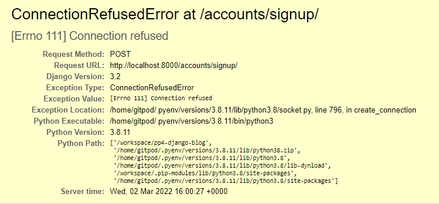

The error is caused when an email Backend is missing from the Settings.py file, and has been solved by adding the email backend and the default "from" email using the following code:

- `EMAIL_BACKEND = 'django.core.mail.backends.console.EmailBackend'`
- `DEFAULT_FROM_EMAIL = 'your choice of email'`

In keeping with the Agile methodology I am using to manage this project, the issue has now been moved to "closed" in Github's issues tracker:

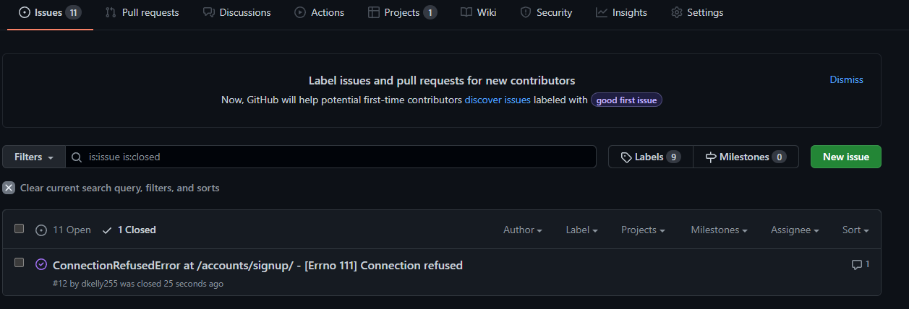

### 2. CSS Formats not applying in Heroku Deployment

When the site was originally developed around fantasy football content, prior to the change in appraoch to a Django blog, an additional bug was present where the CSS styles were not being properly applied in the live deployed (Heroku) site. 

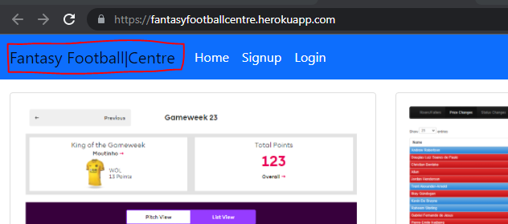

The styles were, however, correct in the Development Environment (Gitpod) site:

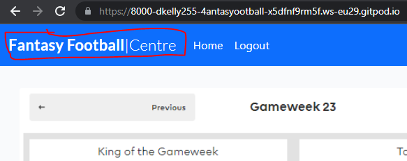

This bug was caused by the debug flag being set to "True" which was preventing the static CSS formats from being correctly recognised by the Heroku application on deployment. Following a change in the debug flag, the bug was resolved: 

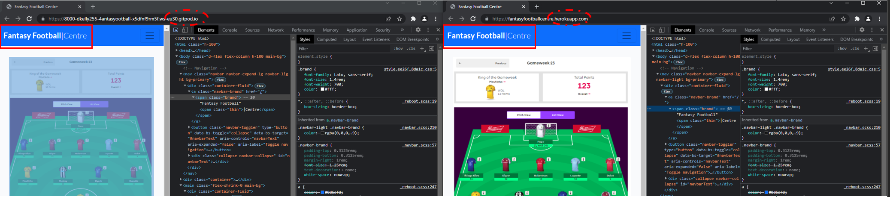

The issue has also been closed in the Agile Methodology Issue Tracker in Github

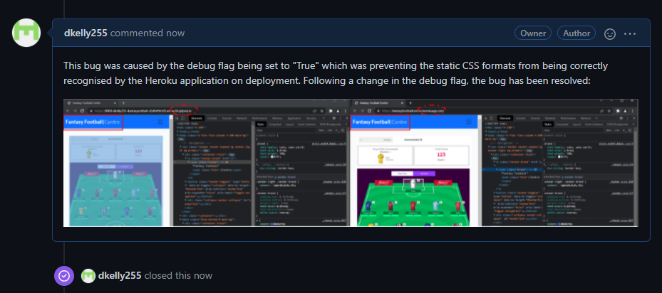

### 3. Failure to Run Test Script
Initially when starting my development of automated testing I encountered the below error in the command line when trying to start the test script:

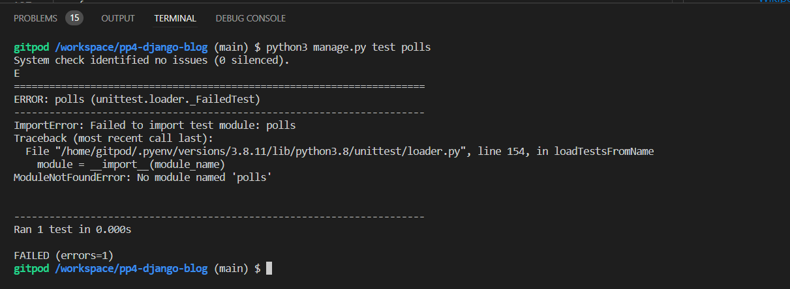

Through researching on debugging this error and working with Code Institute Tutor Support, I discovered that this was due to the database connection - Automated testing must take place in the SQLite database, whereas my project was connected to the PostGreSQL database. 

The solution was to disconnect my project from the production database, and connect to the test database by changing my `DATABASE` variable in `settings.py` from:

```
DATABASES = {
    'default': dj_database_url.parse(os.environ.get("DATABASE_URL"))
}
```
to the updated variable below:

```
DATABASES = {
    'default': {
        'ENGINE': 'django.db.backends.sqlite3',
        'NAME': BASE_DIR / 'db.sqlite3',
    }
}
```

This succesfully resolved the bug and enabled proceeding with the development of the automated testing activties detailed in the "Testing" section of the readme.

### 4. Poll app questions displaying in reverse order

Upon first building the poll app, I noticed that the questions were appearing in reverse order:

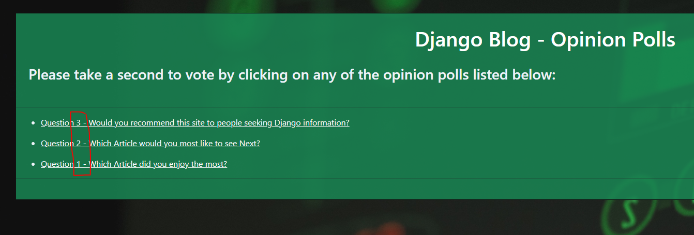

 Whilst this was technicaly not impacting the operation of the site, I found that it was not the optimal User Experience, and wanted to have the questions displaying in numbered sequence. As per the credits section, I had originally used the [official Django Documentation](https://www.google.com/search?q=django+tutorial&oq=django+tutorial&aqs=chrome.0.69i59j0i512l2j69i60l3j69i65l2.1632j0j7&sourceid=chrome&ie=UTF-8) tutorial to develop the poll application, and after researching and troubleshooting I found that this was due to the reverse operator included in the `get_queryset()` method of the `IndexView()` class-based view in `poll/views.py`

By removing the reverse operator from the code, I was able to succesfully resolve the bug, and have the question list display in sequential order, improving the user experience in the process:

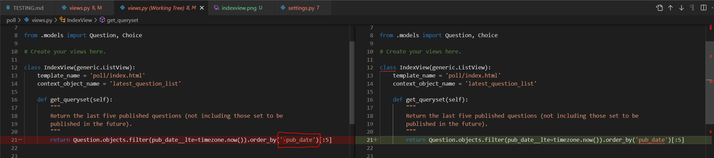

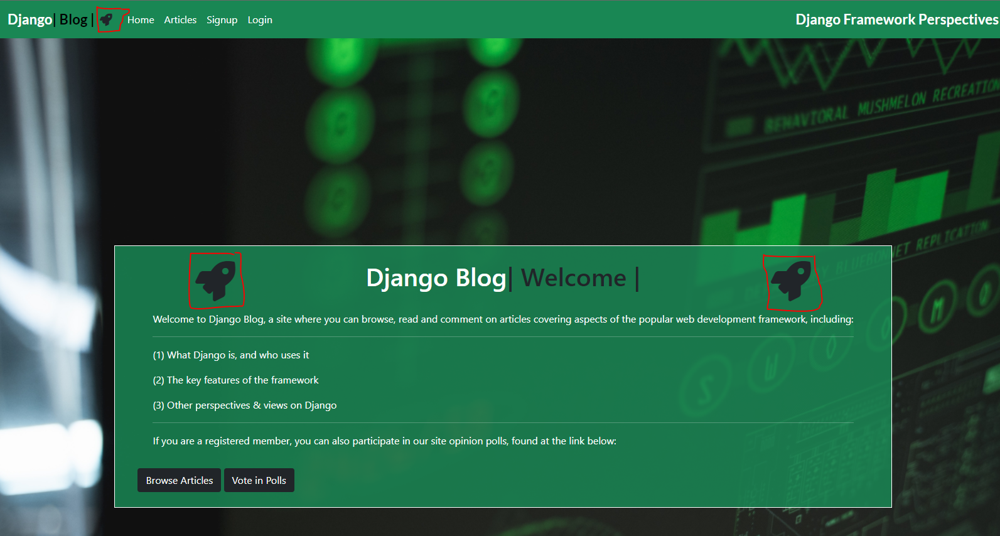

## Unresolved Bugs


### 4. Add email address - username display error 

If an administrator tries to add an email address for a previously registered user (who did not include an email address), the system will not recognise the username, but will only recognise the user "number" - for example, username "brian" has usernumber "3". The username is not recognised by the system, but the usernumber "3" will be recognised:

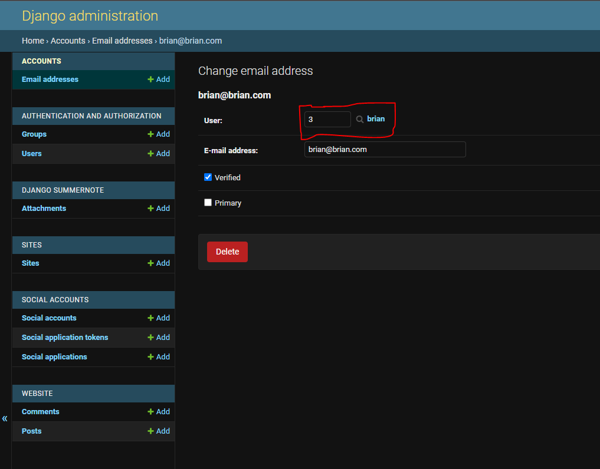

This bug is also currently under investigation for resolution

### 5. Admin Panel display formatting errors

During development, the Administration panel display developed a bug where the standard formatting would not apply and the panel was close to unreadable as a result:

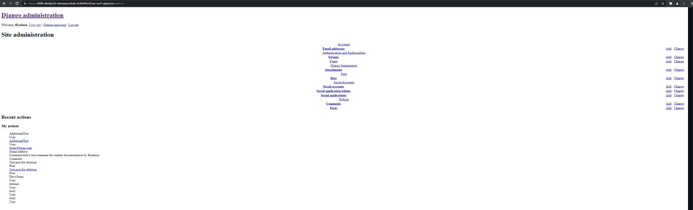

This bug is currently under investigation for resolution
