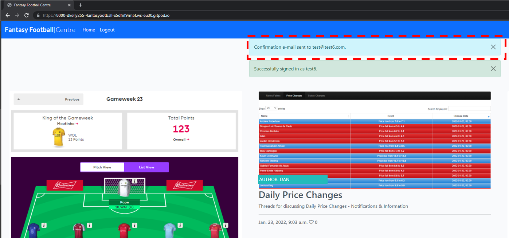

# Bugs

## Resolved Bugs

### 1. Connection Refused - Error code 111

This bug was initially present when trying to sign-up a new user for an account after providing the user's email & password details. 

The error is caused when an email Backend is missing from the Settings.py file, and has been solved by adding the email backend and the default "from" email using the following code:

- `EMAIL_BACKEND = 'django.core.mail.backends.console.EmailBackend'`
- `DEFAULT_FROM_EMAIL = 'your choice of email'`

In keeping with the Agile methodology I am using to manage this project, the issue has now been moved to "closed" in Github's issues tracker:

### 2. CSS Styles

An additional bug is currently present where the CSS styles are not being properly applied in the live deployed (Heroku) site. 

The styles are correct in the Development Environment (Gitpod) site:

This bug was caused by the debug flag being set to "True" which was preventing the static CSS formats from being correctly recognised by the Heroku application on deployment. Following a change in the debug flag, the bug has been resolved: 

The issue has also been closed in the Agile Methodology Issue Tracker in Github

## Unresolved Bugs

### 3. Account created email notification

Upon creation of a new account, a user will receive a notification that a confirmation email has been sent to the email they used during signup. However, currently the email is not sent or received. 

This bug is also currently under investigation for resolution

### 4. Add email address - username display error 

If an administrator tries to add an email address for a previously registered user (who did not include an email address), the system will not recognise the username, but will only recognise the user "number" - for example, username "brian" has usernumber "3". The username is not recognised by the system, but the usernumber "3" will be recognised:

This bug is also currently under investigation for resolution

### 5. Admin Panel display formatting errors

During development, the Administration panel display developed a bug where the standard formatting would not apply and the panel was close to unreadable as a result:

This bug is currently under investigation for resolution
