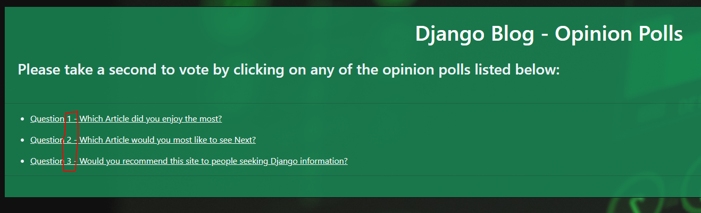
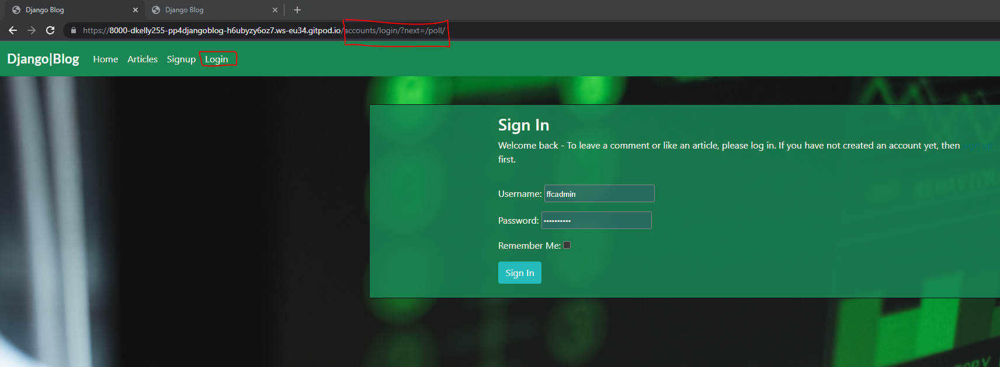
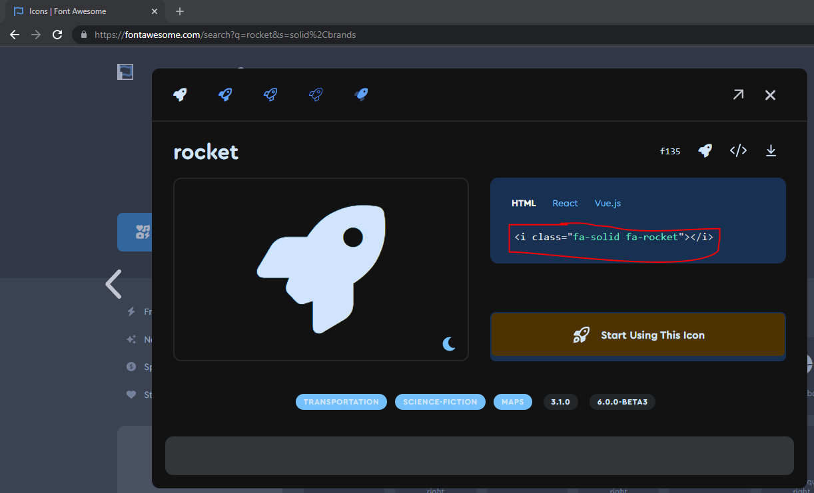

# Bugs

## Resolved Bugs

### 1. Connection Refused - Error code 111

This bug was initially present when trying to sign-up a new user for an account after providing the user's email & password details. 


The error is caused when an email Backend is missing from the Settings.py file, and has been solved by adding the email backend and the default "from" email using the following code:

- `EMAIL_BACKEND = 'django.core.mail.backends.console.EmailBackend'`
- `DEFAULT_FROM_EMAIL = 'your choice of email'`

In keeping with the Agile methodology I am using to manage this project, the issue has now been moved to "closed" in Github's issues tracker:


### 2. CSS Formats not applying in Heroku Deployment

When the site was originally developed around fantasy football content, prior to the change in appraoch to a Django blog, an additional bug was present where the CSS styles were not being properly applied in the live deployed (Heroku) site. 


The styles were, however, correct in the Development Environment (Gitpod) site:


This bug was caused by the debug flag being set to "True" which was preventing the static CSS formats from being correctly recognised by the Heroku application on deployment. Following a change in the debug flag, the bug was resolved: 


The issue has also been closed in the Agile Methodology Issue Tracker in Github


### 3. Failure to Run Test Script
Initially when starting my development of automated testing I encountered the below error in the command line when trying to start the test script:


Through researching on debugging this error and working with Code Institute Tutor Support, I discovered that this was due to the database connection - Automated testing must take place in the SQLite database, whereas my project was connected to the PostGreSQL database. 

The solution was to disconnect my project from the production database, and connect to the test database by changing my `DATABASE` variable in `settings.py` from:

```
DATABASES = {
    'default': dj_database_url.parse(os.environ.get("DATABASE_URL"))
}
```
to the updated variable below:

```
DATABASES = {
    'default': {
        'ENGINE': 'django.db.backends.sqlite3',
        'NAME': BASE_DIR / 'db.sqlite3',
    }
}
```

This succesfully resolved the bug and enabled proceeding with the development of the automated testing activties detailed in the "Testing" section of the readme.

### 4. Poll app questions displaying in reverse order

Upon first building the poll app, I noticed that the questions were appearing in reverse order:


 Whilst this was technically not impacting the operation of the site, I found that it was not the optimal User Experience, and wanted to have the questions displaying in numbered sequence. As per the credits section, I had originally used the [official Django Documentation](https://www.google.com/search?q=django+tutorial&oq=django+tutorial&aqs=chrome.0.69i59j0i512l2j69i60l3j69i65l2.1632j0j7&sourceid=chrome&ie=UTF-8) tutorial to develop the poll application, and after researching and troubleshooting I found that this was due to the reverse operator included in the `get_queryset()` method of the `IndexView()` class-based view in `poll/views.py`

By removing the reverse operator from the code, I was able to succesfully resolve the bug, and have the question list display in sequential order, improving the user experience in the process:




In keeping with the Agile development methodology used to deliver this project, the bug has been documented and closed on the Kanban board & issue tracker in github, as well as this readme document.

### 5. Admin Panel display formatting errors

During development, the Administration panel display developed a bug where the standard formatting would not apply and the panel was close to unreadable as a result:


This bug may also have been caused by a combination of the debug flag and other settings in `settings.py` - as post-resolution of bug#2 above, the admin panel has displayed properly, I have been unable to recreate this error and the bug has not reoccurred. As in keeping with the Agile development methodology used to deliver this project, the bug has been documented and closed on the Kanban board & issue tracker in github, as well as this readme document.


### 6. Unauthorised users permitted to access Polls App

The initial build of my poll application included a bug which enabled a user who was not logged in (and therefore unauthorised and unathenticated) to be able to access the polls application via manually adding `/poll` to the end of the homepage URL:


As part of completing the [Django Tutorial](https://www.youtube.com/watch?v=3aVqWaLjqS4&list=PL-osiE80TeTtoQCKZ03TU5fNfx2UY6U4p&index=7) series from [Corey Schafer](https://www.youtube.com/channel/UCCezIgC97PvUuR4_gbFUs5g) I was able to understand that we can add authorisation & authentication controls to a class-based view by importing a `LoginRequiredMixin` from `django.contrib.auth.mixins`, and including it in the view for the relevant class. 

Upon taking these actions, and importing/adding the `LoginRequiredMixin` from `django.contrib.auth.mixins` to the `IndexView` class in `poll/views.py`, the bug was succesfully resolved, and a non-logged-in user is now re-routed to the `signin` page if trying to circumvent access controls via manual manipulation of the address bar & URL:



I have also added the `LoginRequiredMixin` to the other appropriate views in `poll/views.py` (`DetailView` and `ResultsView` respectively) to prevent similar bugs from being present in the application.

 As per the Agile development methodology used to deliver this project, this bug has been documented and closed on the Kanban board & issue tracker in github, as well as this readme document.

### 7. Fontawesome Icon Display Bugs

During the surface plane development process, I encountered a bug whereby the fontawesome icons I wanted to use would not display properly on the site. Following the fontawesome instructions led to the display errors below:


Debugging this issue, I found that by going back to check my previous projects, it looks like there now is an error in the element code specified on the Fontawesome website for embedding the icons. The fontawesome direction is below, where we are instructed to use the code `<i class="fa-solid fa-rocket"></i>` to embed the icon:



However, this code does not work, and instead the code `<i class="fas fa-rocket"></i>` must be used. Upon updating the element code, the bug is resolved, and the icons will display correctly:


## Unresolved Bugs

There are no known unresolved bugs present in the application at the point in time of this release


