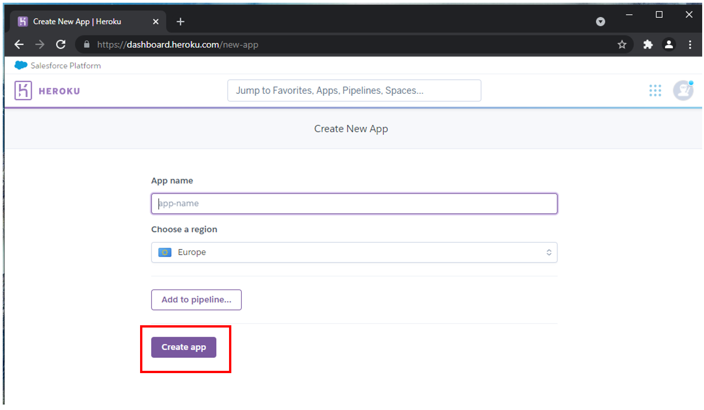

# Deployment
The application was deployed via Heroku, and a link to the live deployment can be found by clicking [here](https://fantasyfootballcentre.herokuapp.com/)

An extended list of detailed steps & instructions for deployment is covered in the section below:

## Github Deployment
Note - please ensure you have created a GitHub repository prior to proceeding to the "Heroku" deployment section below to ensure no rework or deployment issues

## Heroku Deployment
The Steps for deployment to Heroku are as follows - Please note these steps are correct and current as at the time of application release (March 2022) but may be subject to change in future:

- Navigate to [Heroku](https://id.heroku.com/login) and create an account

- From the Heroku dashboard select the “Create new app” button.

- Choose a name for the application - I have chosen Fantasy Football Centre but please note that the name must be unique.

- Select your region 

- Then click “Create app” - this will trigger a page with all the information for setting up the app.

Settings Tab:

- Config Vars - It is important to get your settings section done before you deploy  your code, the first section being the "config vars" - also known as "environment variables", are where sensitive data that needs to be kept private is stored. In the case of this website & app the  required "CLOUDINARY_URL", "DATABASE_URL", and "SECRET_KEY" config vars are shown below:

- Buildpacks - The next step is to add buildpacks - These install further dependencies that we need. Click “Add buildpack”, add the Python buildpack first and then click “Save changes”. 

Deployment Tab: 

- Select Github here, and then we  can confirm that we want to connect to Github & search for the equivalent Github repository name, followed by “Search”. 

- Next, click “connect” to link up the Heroku app to our Github repository code, and scroll down to see two options - for manual or automatic deployment
- If you choose to enable automatic deployment then Heroku will rebuild the app every time you push a new change to your code in Github. 
- Alternatively you can choose to  manually deploy using the "deploy branch" option
- Finally, you will see the “App was successfully deployed” message  
and a button for the deployed link. 

## Local Deployment
Additionally - if you would like to make a local copy of the Github repository, you can clone it by typing the following command in your IDE terminal:

- `git clone https://github.com/dkelly255/fantasy-football-centre.git`

Alternatively, if you use Gitpod, you can click the button below to generate a new workspace using this repository.

