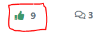
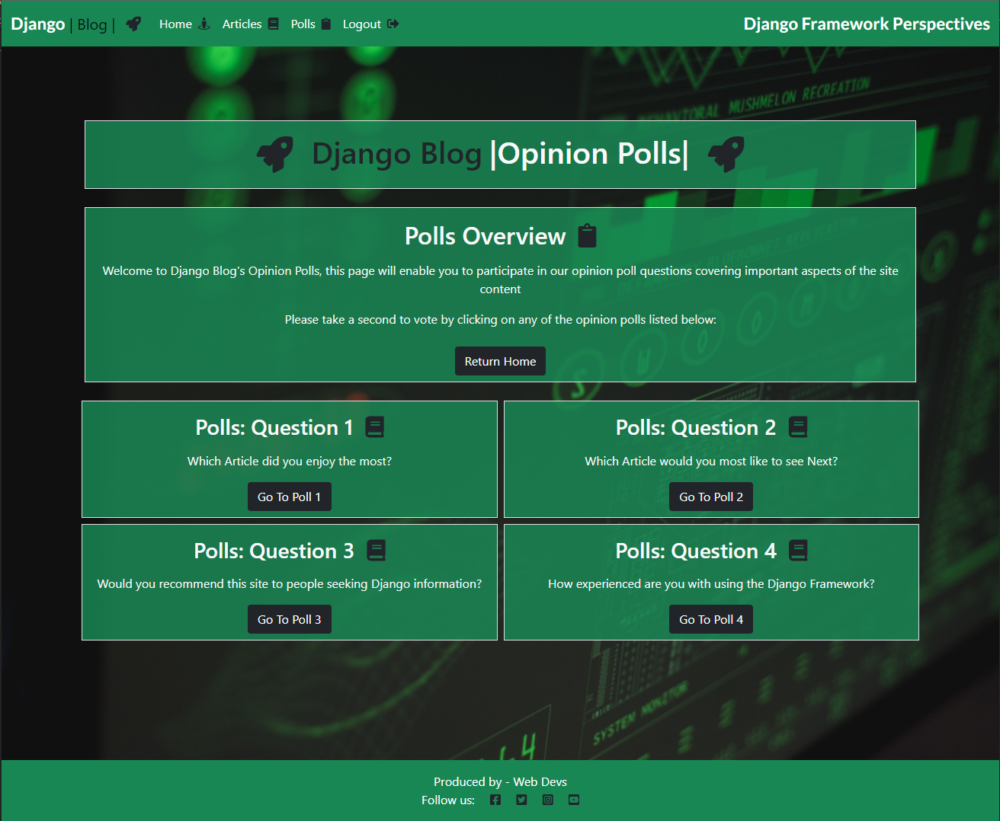
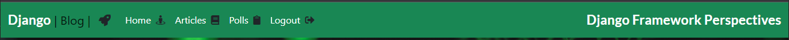
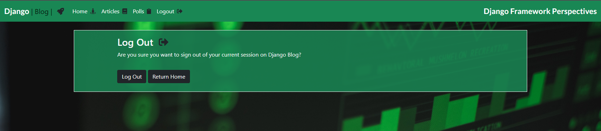
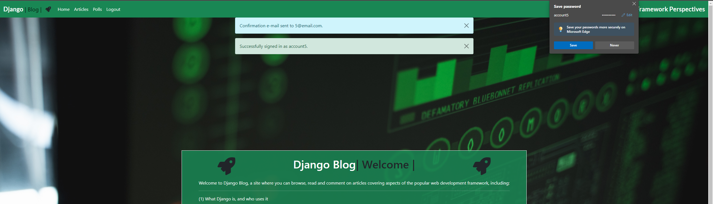

# Features

## 1. CRUD Features:

As described in detail in this helpful [article](https://www.sumologic.com/glossary/crud/#:~:text=CRUD%20Meaning%3A%20CRUD%20is%20an,%2C%20read%2C%20update%20and%20delete.) from [Sumologic.com](https://www.sumologic.com/), CRUD is an acronym that refers to the four functions that are considered necessary to implement a persistent storage application: create, read, update, and delete. 

Below you can see details on the CRUD features and funcitonality of the Django Blog application, with examples and illustrations of each key operation:

### - Create Records:

#### (i) Create an article:

A key feature within the administration area is the ability to add articles. The articles form the majority of the site content, and this option allows a superuser or administrator to add new articles when required to keep the site current and up to date with recent events of interest to the site's target audience. As you can see from the screenshot below, there are fields allowing the Article attributes to be built out, including - title, slug, author, a hero image, an excerpt and the actual article body/content. Changing the article status from "draft" to "published" will trigger the article's publication on the live site.

#### (ii) Create a comment:

This additional functionality allows a user to add comments to the site articles. This adds a degree of interactivity to the site, and acts as a discussion board where users can discuss and debate current topics of interest in relation to Django. Note, from a site security & administration perspective - a user must be signed in to leave a comment, and the comments must be individually approved by a site superuser/admin before they will be publicly visible below the articles.

#### (iii) Add a Like to an article:

This feature allows a user who is signed in to add a like an article by clicking on the like/heart icon under each article. When a user clicks the button it will increment the like count by one. When the article has been liked, the heart icon will turn solid red:

#### (iv) Create an account:

In order to create an account, Users should navigate to the "Signup" link in the nav bar, this will bring the user to the "Signup" page shown below, built using Crispy Forms, and consists of an invitation & instruction set to the user to direct them on how to create an account with the site.

There is an additional prompt on the signup form reminding the user that they should "Sign In" rather than "Sign Up" if they already have an account, and following that, there are four fields the user can fill in to supply the required details for creation of a new account - Username, Email, Password, and a confirmation of the password.

#### (iv) Create a Poll Question:

Another key element of the "Create" CRUD functionality of the site is the ability to create new poll questions. This can be completed by navigating to the administration area, and choosing the `add` option beside the `Questions` element of the `poll` app as shown in the screenshot below, then completing the required fields, `Question text`, and `Published Dates`, followed by selecting the `Save` option:

#### (iv) Create Answer Choices for a Poll Question:

The next element of the "Create" CRUD functionality consists of the ability to create answers/choices for Existing Poll Questions. This can be completed by navigating to the administration area, and choosing the `add` option beside the `Choices` element of the `poll` app as shown below, then completing the required fields, `Question`, and `Choice Text`, followed by selecting the `Save` option.

### - Locate Records:

#### (i) Articles Page

The Articles page allows users to locate article/post records from the backend/database, and is constructed with customised Bootstrap HTML/CSS. This is where the site users will land upon asking to view the articles via either the nav bar (see below) or the "view articles" option on the home page (see above). The Articles page is designed to enable users to seamlessly locate & access the site's content, via a combination of the intuitively laid out navigation bar & clickable links to site articles. The page is also fully responsive, utilising bootstrap responsiveness/scaling features to ensure a positive UX on devices of all screen-sizes. A snapshot of the feature is shown below:

#### (ii) Polls Page

A user can locate Poll questions via this feature, provided they are correctly authorised by signing in. Similar to the Article display page above, it is constructed with customised Bootstrap HTML/CSS and is where the site users will land upon asking to view the Polls via either the nav bar (see below) or the "polls" option on the home page (see above). The Polls page is designed to enable users to seamlessly locate & access the site's poll content, via a combination of the intuitively laid out navigation bar & clickable links to Poll questions. The page is also fully responsive, utilising bootstrap responsiveness/scaling features to ensure a positive UX on devices of all screen-sizes. A snapshot of the poll page feature is shown below:

### - Display Records:

#### (i) Article Display

This feature enables the user to drill down into the contents of the site by clicking on the title of any article. Upon clicking, the detailed article view will load, showing the article's main image, followed by the textual content. This feature is the heart of the site functionality, and is where site visitors can browse & digest the Django-related content on a regular basis. The formatting is again put together using custom bootstrap, and the design ensures a positive UX by having an uncluttered, clear area of focus for the site visitor.

#### (ii) Answer Choice Display

This feature enables the user to drill down into the available question answer choices by clicking on the individual poll question. Upon clicking, the detailed poll answer choice view will load, showing the Poll's question, followed by the available answers, against which a user can vote if they wish. This feature is also at the heart of the site functionality, and is where site visitors can give their opinions on the Django-related poll questions. The formatting is again put together using custom bootstrap, and the design ensures a positive UX by having an uncluttered, clear area of focus for the site visitor.

#### (iii) Poll Results Display

This feature enables the user to view a display of the results of the poll question they have voted in. It is accessed by voting in a poll question, and will automatically display to the user following their vote, showing each available answer choice, and a running total of the votes accumulated for each choice, together with an option to return to the home page, or to view the site articles:

### - Edit Records:

#### (i) Vote in a poll

#### (ii) Edit an article
Additionally, the "Change Post" option will allow a Superuser or Administrator to edit the content of a pre-existing article. This is a useful feature for when Articles either contain erroneous information, or need to be augmented with additional late-breaking news relative to the Article's content. This feature can also be used to correct any typographical or grammatical errors that may have accidentally made their way into previously published articles.

#### (iii) Approve a comment
The application also contains features which help with the management of the comments posted on articles in the site. Before any comment can be publicly displayed, it must be edited (specifically - its status must be changed to "approved" by an administrator), to minimize the risk of offensive or illegal comments being posted. When an administrator or superuser wants to approve a comment, he or she can simply select the comment from the menu, check the appropriate selection box, and then select "approve comments" from the dropdown menu:

#### (iv) Edit a Poll Question 

This aspect of the "Edit" section of the applications CRUD featureset allows an administrator to edit the contents of a pre-existing poll question record. In order to complete this, navigate to the administration area location shown in the screenshot below (`Home/Poll/Questions/Question`), which will then allow the edit functionality to be applied to the question text and/or publication dates & times:

#### (v) Edit a Poll Answer Choice

Similarly, this aspect of the "Edit" section of the applications CRUD featureset allows an administrator to edit the contents of a pre-existing poll question answer choice. In order to complete this, navigate to the administration area location shown in the screenshot below (`Home/Poll/Choices/Choice`), which will then allow the edit functionality to be applied to the Answer text and/or the question it is linked to:

### - Delete Records:

#### (i) Delete an article
The "Delete an article feature" grants a user with the correct permissions the ability to remove previously published articles from the site's content. This feature ensures that the site content can be maintained & kept current, and would allow reacting to any unexpected or accidental misinformation or errors that may require an article to be deleted from the site. The superuser/admin must check the box to the left of the article they wish to delete, and then select the delete option from the drop-down menu & confirm.

#### (ii) Delete a Like from an article:

This feature allows a user who is signed in to delete a like they may have previously added to an article in error by re-clicking on the like/heart icon under each article. When a user clicks the button to unlike the article, it will decrement the like count by one and delete the previously added like from the article. When the article has been unliked, the heart icon will revert back to hollow/red outline:

### (iii) Delete a comment
The functionality to delete a previously approved (or unapproved) comment is also present in the Django Blog web application - via this option a super user or administrator can select the comment they wish to delete by checking the appropriate selection box, and simply select "delete selected comments" from the dropdown menu:

### (iv) Delete a Question

In order to delete a pre-existing question record, simply navigate to the question section of the administration area shown in the screenshot below, and after selecting the appropriate question, the `Delete` button can clicked. This will trigger a warning to the user asking if they wish to confirm the deletion, and the record will be removed.

### (v) Delete a Choice

In order to delete an answer choice from a question record, simply navigate to the question section of the administration area shown in the screenshot below, and after selecting the appropriate answer choice, the `Delete` button can clicked. This will trigger a warning to the user asking if they wish to confirm the deletion, and the record will be removed.

## 2. Other Key Existing Features

In addition to the core CRUD functionality & features described above, there are many additional key features underpinning the functionality of the Django Blog application, the most important of which are described & reviewed below:

### - Home Page

The Home page is where visitors will initially land upon loading the site, and consists of a centralised welcome message, greeting the user, and informing them about the purpose of the site. The welcome message also contains a direct link to the site content/articles, allowing the user to quickly and seamlessly progress to the main site content. A link to the polls feature is also included to allow the user to vote in the site opinion polls should they wish to do so.

### - Nav Bar
The Nav bar contains links to the main functionality sections of the site, and contains a highlight to both show the user which page they are currently on, as well as highlighting when the user scrolls over a clickable link. The Nav bar is also fully responsive from ultra-wide down to mobile device screen sizes below 300 pixels in width, and contains the site tag line "Django Framework Perspectives" to the right hand side to help promote a positive UX for site visitors:

### - Footer
The site footer contains "Constructed By" label crediting the site to (fictional) FFC Devs, as well as clickable links to various external Social Media sites where users can connect. The links will always open in a new tab, and the footer is fully resposive using media queries from large screens down to small mobile devices. It contains a combination of green backgrounds, with white text and borders to ensure high contrast ratios and for consistency with the site's design & color scheme.

### - Login Form

The Login form is also built using Crispy Forms, and gives two fields for completion to authenticate the user for access to the site features such as leaving comments or liking articles. There is an additional notification to the user on the Login form that they must be logged in to like an article or leave a comment, and that if they have not yet created an account that they must Sign Up first.

### - Logout Form

The Lougout form screenshot is shown below, illustrating the simple & intuitive nature of this feature, whereby the user is prompted with a confirmation that they wish to log out of the site, and a button they can click to confirm they wish to do so. A defensive design principle has been used for this form, so that a user cannot log out mistakenly with a single click, the confirmation button will help provide a positive UX where the user is less likely to log out accidentally.

### - Comment Counter

The comment counter is present under all articles created on the site, and performs the role of allowing site visitors to see at a glance how many comments have been lodged under each article, giving a sense of how much discussion and debate an article may have generated. Each time a comment has been approved by the administrator/superuser, the comments counter will increment by one:

### - Administration Area

The administration area is a key feature of the Django Blog web application, and allows the site administrator/super-user to control many key site activities to keep the application in working order. The administration area has been craeted using Django's administration functionality, and contains many key functions, illlustrated in the snapshot below, and reviweed in detail in the remainder of the feature walkthrough section of this readme document:

### - Login Notification Message

To help with contrbuting to as positive a User Experience as possible, several Javascript-driven notification messages are also designed into the application. The first of these is triggered when a User Logs into the site, and is displayed in the screenshot below. The message will appear on the screen upon login, and will disappear automatically via Javascript programming after a pre-set time interval:

### - Logout Notification Message

The equivalent message displayed to a user when logging out is shown below:

### - Account Creation Notification Message

The equivalent messages displayed to a user when creating a new account are also shown below:

## 3. Future Features 
In addition to the existing features there are several additional features which can be added to augment the application in future and are yet to be implemented:

### - Notifications

A future feature for site implementation would be the addition of a notifications choice for users. This would allow users who wish to avail of the option to receice notifications when a new article is posted to the site, and/or when their comments have had replies in the discussion areas. This feature is currently out of scope due to project deadlines, but will hopefully be added at a future time to improve the User Experience and broaden the suite of features offered by the site.

### -  Membership Tiers Addition

This would involve adding functionality to the site whereby existing users have the choice to upgrade their account to a "Premium Member" - which would in turn give them access to additional premium features not accessible to a default user. 

### - Premium articles & Analysis

Following on from the Member's area would be additional members-only articles, and access to player data & analysis to help premium members gain even more insight into Django and it's hisotry, purpose, and usage. This would require changes to existing models, and the addition of new models and in the interest of project deadlines is currently out of scope for the current release.

### - Forgotten Password Functionality

This would give users the ability to reset their password should they wish to do so in the event of forgetting their existing login credentials, thereby improving the User Experience and adding a further dimension to the functionality of the site

### - Social Media Sign-ins

The addition of the ability to sign-in via a user's existing social media account/s (Google, Facebook, Instagram etc) would add further functionality to the site and broaden the User Experience, however in the interests of project timelines this set of features is currently out of project scope for the current release.
