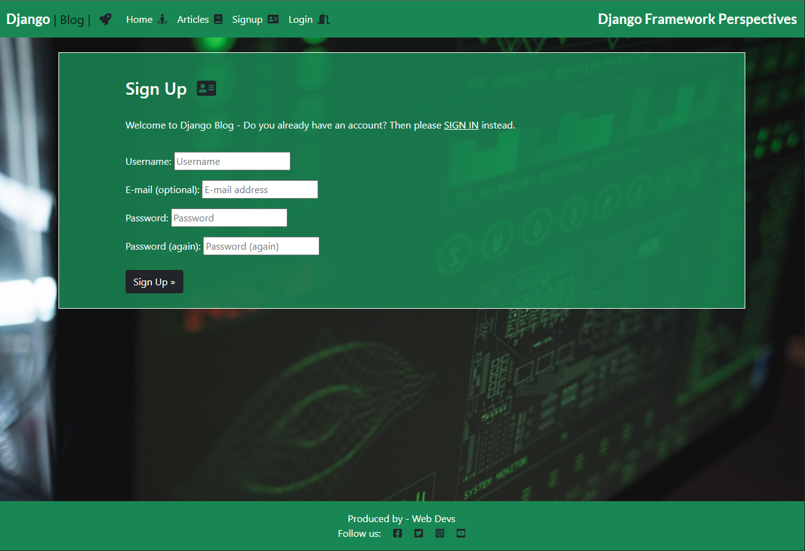
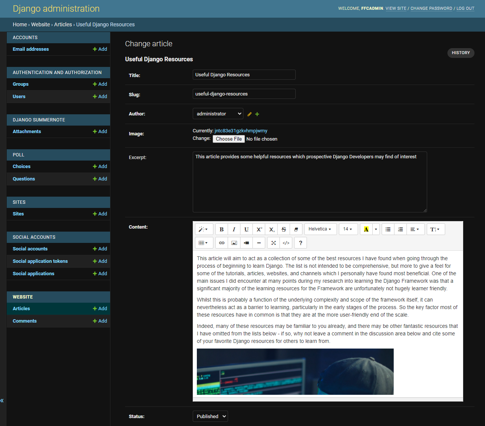

# Features
## Existing Features

### - Home Page

The Home page is constructed primarily using customised Bootstrap, and is where the site users will intially land upon visiting the site. The Home page is designed to enable users to seamlessly access the site's content, via a combination of the intuitively laid out navigation bar & clickable links to site articles. The page is also fully responsive, utilising bootstrap responsiveness/scaling features to ensure a positive UX on devices of all screen-sizes. A snapshot of the home page feature is shown below:

### - Nav Bar
The Nav bar contains links to the main functionality sections of the site, and contains a highlight to both show the user which page they are currently on, as well as highlighting when the user scrolls over a clickable link. The Nav bar is also fully responsive from ultra-wide down to mobile device screen sizes below 300 pixels in width, and contains the site tag line "The Centre of the action" to the right hand side to help promote a positive UX for site visitors:

### - Footer
The site footer contains "Constructed By" label crediting the site to (fictional) FFC Devs, as well as clickable links to various external Social Media sites where users can connect. The links will always open in a new tab, and the footer is fully resposive using media queries from large screens down to small mobile devices. It contains a combination of blue backgrounds, with white text and borders to ensure high contrast ratios and for consistency with the site's design & color scheme.

### - Signup Form
The Sign Up form is built using Crispy Forms, and consists of a brief, but concise invitation & instruction set to the user to direct them on how to create an account with the site. There is an additional prompt on the form reminding the user that they should "Sign In" rather than "Sign Up" if they already have an account, and following that, there are four fields the user can fill in to supply the required details for creation of a new account - Username, Email, Password, and a confirmation of the password.

### - Login Form

The Login form is also built using Crispy Forms, and gives two fields for completion to authenticate the user for access to the site features such as leaving comments or liking articles. There is an additional notification to the user on the Login form that they must be logged in to like an article or leave a comment, and that if they have not yet created an account that they must Sign Up first.

### - Logout Form

The Lougout form screenshot is shown below, illustrating the simple & intuitive nature of this feature, whereby the user is prompted with a confirmation that they wish to log out of the site, and a button they can click to confirm they wish to do so. A defensive design principle has been used for this form, so that a user cannot log out mistakenly with a single click, the confirmation button will help provide a positive UX where the user is less likely to log out accidentally.

### - Article Display

This feature enables the user to drill down into the contents of the site by clicking on the title of any article. Upon clicking, the detailed article view will load, showing the article's main image, followed by the textual content. This feature is the heart of the site functionality, and is where site visitors can browse & digest the Fantasy Football content on a regular basis. The formatting is again put together using custom bootstrap, and the design ensures a positive UX by having an uncluttered, clear area of focus for the site visitor.

### - Add a comment

This additional functionality allows a user to add comments to the site articles. This adds a degree of interactivity to the site, and acts as a discussion board where users can discuss and debate current topics of interest in relation to Fantasy Football. Note, from a site security & administration perspective - a user must be signed in to leave a comment, and the comments must be individually approved by a site superuser/admin before they will be publicly visible below the articles.

### - Add a Like/Unlike

This feature allows a user who is signed in to like (or unlike) an article by clicking on the like/heart icon under each article. When a user clicks the button it will increment the like count by one, and when a user clicks the icon a second time, it will decrement the like counter by one to "unlike" the previous like. When the article has been liked, the heart icon will turn solid red, and if it is unliked, the icon will return to its hollow red outline format:

### - Comment Counter

The comment counter is present under all articles created on the site, and performs the role of allowing site visitors to see at a glance how many comments have been lodged under each article, giving a sense of how much discussion and debate an article may have generated. Each time a comment has been approved by the administrator/superuser, the comments counter will increment by one:

### - Administration Area

The administration area is a key feature of the Fantasy Football Centre web application, and allows the site administrator/super-user to control many key site activities to keep the application in working order. The administration area has been craeted using Django's administration functionality, and contains many key functions, illlustrated in the snapshot below, and reviweed in detail in the remainder of the feature walkthrough section of this readme document:

### - Add an article

A key feature within the administration area is the ability to add articles. The articles form the majority of the site content, and this option allows a superuser or administrator to add new articles when required to keep the site current and up to date with recent events of interest to the site's target audience. As you can see from the screenshot below, there are fields allowing the Article attributes to be built out, including - title, slug, author, a hero image, an excerpt and the actual article body/content. Changing the article status from "draft" to "published" will trigger the article's publication on the live site.

### - Edit an article
Additionally, the "Change Post" option will allow a Superuser or Administrator to edit the content of a pre-existing article. This is a useful feature for when Articles either contain erroneous information, or need to be augmented with additional late-breaking news relative to the Article's content. This feature can also be used to correct any typographical or grammatical errors that may have accidentally made their way into previously published articles.

### - Delete an article
The "Delete an article feature" grants a user with the correct permissions the ability to remove previously published articles from the site's content. This feature ensures that the site content can be maintained & kept current, and would allow reacting to any unexpected or accidental misinformation or errors that may require an article to be deleted from the site. The superuser/admin must check the box to the left of the article they wish to delete, and then select the delete option from the drop-down menu & confirm.

### - Approve a comment
The application also contains features which help with the management of the comments posted on articles in the site. Before any comment can be publicly displayed, it must be approved by an administrator, to minimize the risk of offensive or illegal comments being posted. When an administrator or superuser wants to approve a comment, he or she can simply select the comment from the menu, check the appropriate selection box, and then select "approve comments" from the dropdown menu:

### - Delete a comment
The functionality to delete a previously approved (or unapproved) comment is also present in the Fantasy Football Centre web application - via this option a super user or administrator can select the comment they wish to delete by checking the appropriate selection box, and simply select "delete selected comments" from the dropdown menu:

## Future Features 
In addition to the existing features there are several additional features which can be added to augment the application in future and are yet to be implemented:

### - Notifications

A future feature for site implementation would be the addition of a notifications choice for users. This would allow users who wish to avail of the option to receice notifications when a new article is posted to the site, and/or when their comments have had replies in the discussion areas. This feature is currently out of scope due to project deadlines, but will hopefully be added at a future time to improve the User Experience and broaden the suite of features offered by the site.

### -  Membership Tiers Addition

This would involve adding functionality to the site whereby existing users have the choice to upgrade their account to a "Premium Member" - which would in turn give them access to additional premium features not accessible to a default user. 

### - Premium articles & Analysis

Following on from the Member's area would be additional members-only articles, and access to player data & analysis to help premium members gain an edge with their fantasy football management. This would require changes to existing models, and the addition of new models and in the interest of project deadlines is currently out of scope for the current release.

### - Forgotten Password Functionality

This would give users the ability to reset their password should they wish to do so in the event of forgetting their existing login credentials, thereby improving the User Experience and adding a further dimension to the functionality of the site

### - Social Media Sign-ins

The addition of the ability to sign-in via a user's existing social media account/s (Google, Facebook, Instagram etc) would add further functionality to the site and broaden the User Experience, however in the interests of project timelines this set of features is currently out of project scope for the current release.