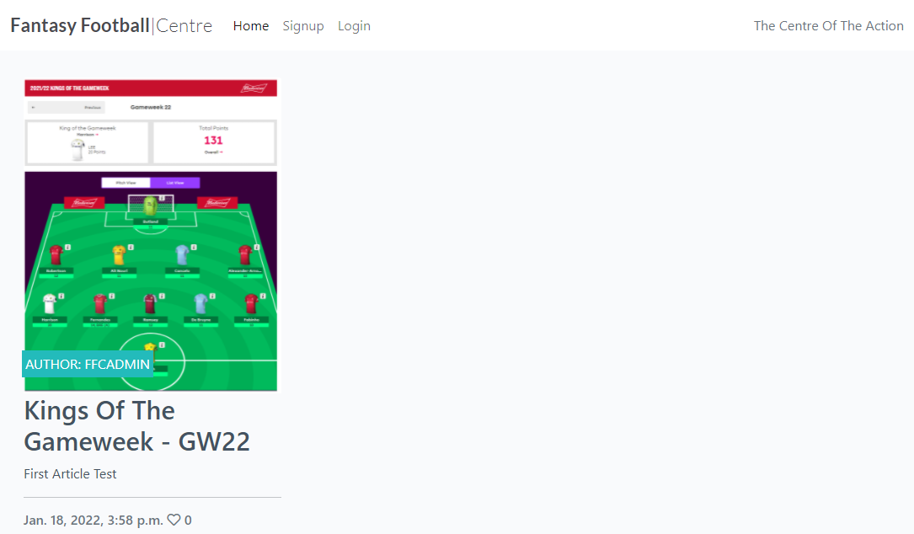
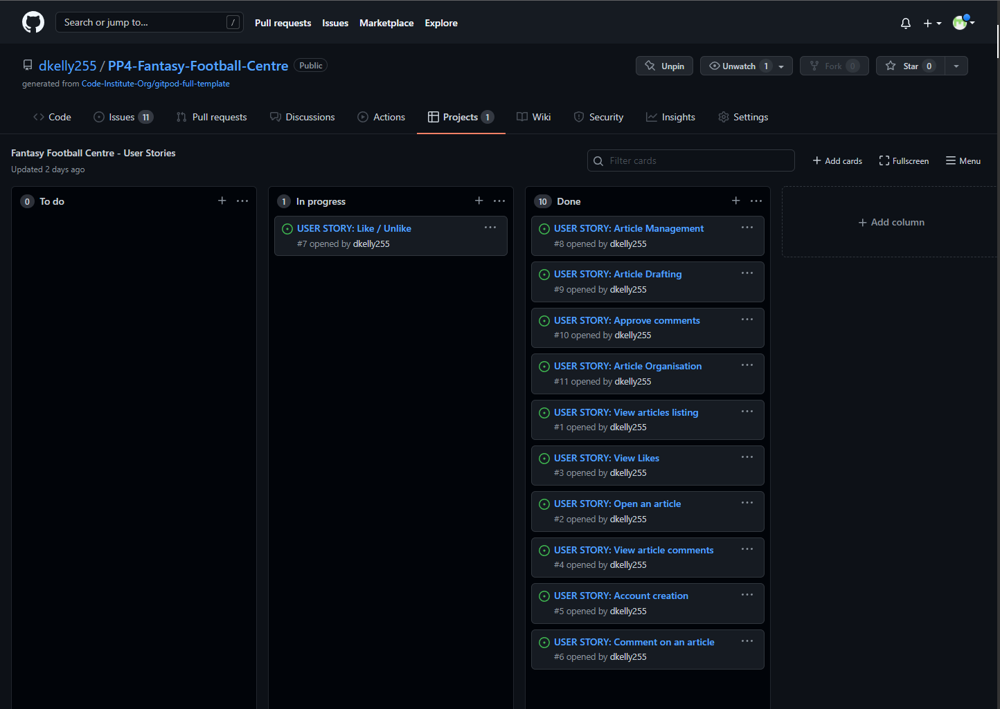

# Fantasy Football Centre

Fantasy Football Centre (FFC) is a Django-based web application that will allow users to browse, read, and comment on Fantasy Football Content. 
# UX Planes
I have designed the site using the five planes of UX approach, each of which is reviewed in detail in the following sections
## Strategy
The strategy for the site is to offer a one-stop shop to users interested in Fantasy Football where they can obtain content in the form of Articles, and can have the ability to post their own comments on the subject matter to engage in discussion within a braoder community of Fantasy Football enthusiasts. 

The strategic aim of the site is to address the following user stories:

As a site user I can:
- Create and register for an account so that I can add my own comments and likes to the articles and content
- View a list of the site's articles so that I can select one to read
- View an organised list of artciles so that I can select which article I wish to view
- Open an article so that I can read the full content
- Add my own comments to articles so that I can join in the discussion on current fantasy football hot topics and issues

As a site administrator I can:
- Have full CRUD (Create, Read, Update, Delete) abilities so that I can manage the content of the website
- Create draft articles so that I can complete the articles at a later time
- Approve or reject comments so that I can ensure no unacceptable comments are posted on the site

As both a site user and administrator I can:
- View a count of likes on each article so that I can guage general user sentiment on the site content
- View other user's comments on articles so that I can understand other site user's perspective's an opinions on the content

## Scope

To deliver the scope of the project, an Agile approach to Software Development has been pursued for the project implementation, with the user stories above being managed via Github's Kanban board functionality.

A view of the Kanban board with the user stories having been brought through "To Do", "In Progress", and "Done" columns as follows:

## Structure

The website is structured using the Django Framework functionality, with a home page, a login option, and a signup page. The home page contains the main content of the site, housing the Fantasy Football Articles, together with the comments that have been posted by other users/viewers

## Skeleton

The wireframes below illustrate the skeleton of the site, including the home page, login page, signup page, together with the various nav bars and footers that underpin the site structure:

- Wireframe 1 - Home Page
- Wireframe 2 - Article page
- Wireframe 3 - Comment detail
- Wireframe 4 - Signup Page
- Wireframe 5 - Login page
- Wireframe 6 - Administration page

## Surface

The Bootstrap framework has been used to construct the Surface of the website, with the following design choices helping to deliver the optimum user experience:

- Typography
- Imagery
- Color Palette

# Features
## Existing Features
## Future Features 
# Testing
# Bugs
## Resolved Bugs
## Unresolved Bugs
# Technologies Used
# APIs & Configuration
# Deployment
## Github Deployment
## Heroku Deployment
## Local Deployment
# Credits
## Content
## Code
## Media

Entity Relationship Diagrams:

Articles:
Fields: Key, Name, Type
Title (Unique) - Char[200]
(1TM - Foreign Key) Author - Take from User Model
Creation Date - DateTime
Updated Date - DateTime
Content - TextField
Featured Image - Cloudinary Image
Excerpt - TextField
(MTM) Likes - User Model
Slug (unique) - SlugField
Status - Integer

Comments:
Key, Name, Type, Extra Info
Foreign Key - post, Post Model, Cascade on delete
name, CharField, Max length 80
email, EmailField
body, TextField
created_on, DateTimeField, auto_now_add True
approved, BooleanField, default False