# Fantasy Football Centre
Fantasy Football Centre (FFC) is a Django-based web application that will allow users to browse, read, and comment on Fantasy Football Content:

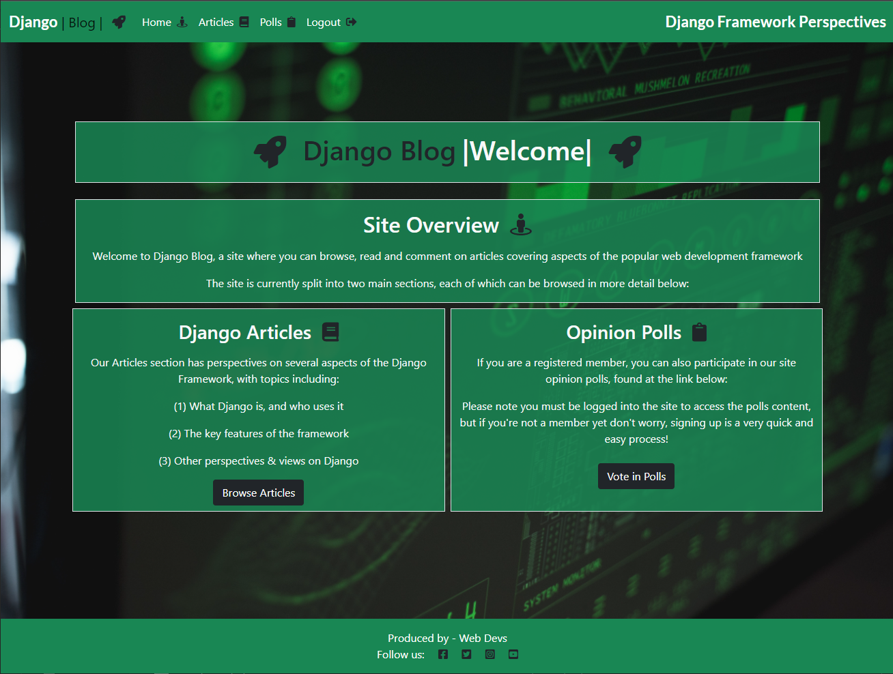

# UX Planes
I have designed the site using the five planes of UX approach, each of which is reviewed in detail in the following sections
## Strategy
The strategy for the site is to offer a one-stop shop to users interested in Fantasy Football where they can obtain content in the form of Articles, and can have the ability to post their own comments on the subject matter to engage in discussion within a braoder community of Fantasy Football enthusiasts. 

The strategic aim of the site is to address the following user stories:

### As a site user I can:
- Create and register for an account so that I can add my own comments and likes to the articles and content
- View a list of the site's articles so that I can select one to read
- View an organised list of artciles so that I can select which article I wish to view
- Open an article so that I can read the full content
- Add my own comments to articles so that I can join in the discussion on current fantasy football hot topics and issues

### As a site administrator I can:
- Have full CRUD (Create, Read, Update, Delete) abilities so that I can manage the content of the website
- Create draft articles so that I can complete the articles at a later time
- Approve or reject comments so that I can ensure no unacceptable comments are posted on the site

### As both a site user and administrator I can:

- View a count of likes on each article so that I can guage general user sentiment on the site content
- View other user's comments on articles so that I can understand other site user's perspective's an opinions on the content

## Scope

To deliver the scope of the project, an Agile approach to Software Development has been pursued for the project implementation, with the user stories above being managed via Github's Kanban board functionality.

A view of the Kanban board with the user stories having been brought through "To Do", "In Progress", and "Done" columns as follows:

## Structure

The website is structured using the Django Framework functionality, with a home page, a login option, and a signup page. The home page contains the main content of the site, housing the Fantasy Football Articles, together with the comments that have been posted by other users/viewers.

The core website data  will be stored in Heroku's PostgreSQL add-on, and website static files and media/images will be stored on the Cloudinary Platform. I have made the decision to store website images on Cloudinary rather than Heroku due to the fact that Heroku is an ephemeral file system, and the Dyno system it utilizes can cause problems in situations where the project has been idle or if it has not been accessed for a certain length of time. Cloudinary is a persistent file store, and will therefore minimise the likelihood of such issues occurring and interrupting or deteriorating the User Experience, ensuring site visitors have less chance of seeing broken image links when browsing the site. In terms of the Cloudinary design choice, it is also less complicated to setup than other persistent file stores (such as Amazon S3 or Microsoft Azure) so will fit well for the scope of this project.

## Code Structure

## Database Structure

The site's content will utilise a simple database structure, consisting of two main models - one for the Fantasy Football Articles, and one for the comments that users can add to those articles

The Entity Relationship Diagram for the Articles Table is shown below, with the field names, types, and key status. 

Note the Foreign Key will be the "Author" field, and that the "Likes" field will also need to have a many to many relationship:

The Entity Relationship Diagram for the Comments Table is shown below, with the field names, types, key status, and additional information. 

Note the Foreign Key will be the "Post" field, and that this will need to cascade on delete, so that when a post is removed, the comments on that post are also removed, that is, the deletion is cascaded through the models.

### - PostgreSQL:

## Skeleton

The wireframes below illustrate the skeleton of the site, including the home page, login page, signup page, together with the various nav bars and footers that underpin the site structure:

- Wireframe 1 - Home Page

- Wireframe 2 - Article detail & comments 

- Wireframe 3 - Signup Page

- Wireframe 4 - Login page

- Wireframe 5 - Administration page

## Surface

The Bootstrap framework has been used to construct the Surface of the website, with the following design choices helping to deliver the optimum user experience:

- Typography
- Imagery
- Color Palette
- Summernote - WYSIWYG editor for admin panel

# Features
## Existing Features

### - Home Page

### - Nav Bar

### - Footer

### - Signup Form

### - Login Form
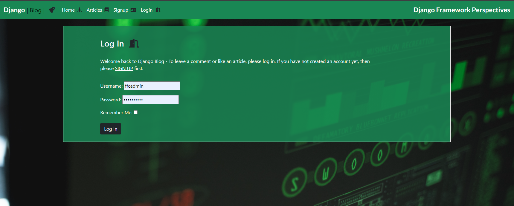

### - Logout Form

### - Article Display
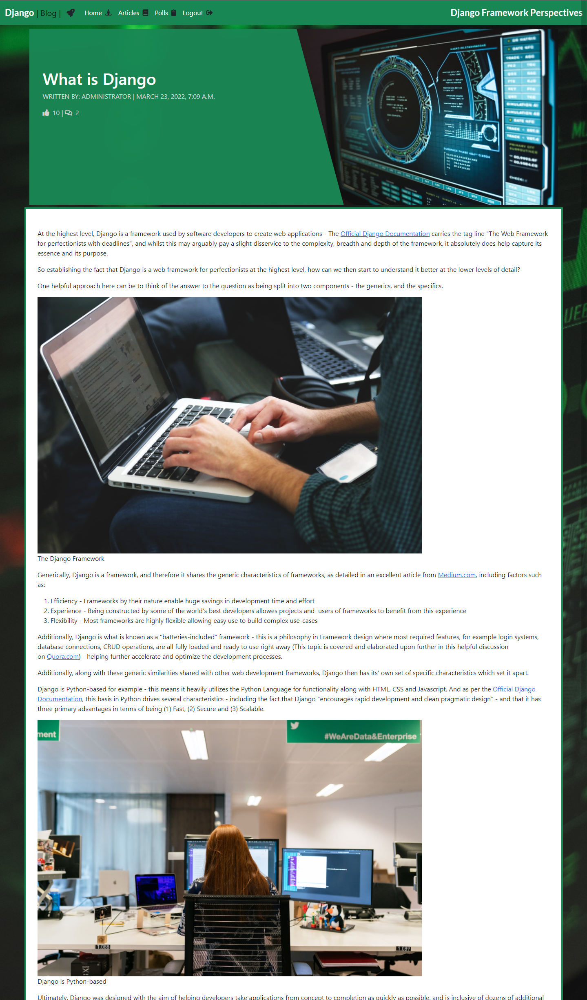

### - Add a comment

### - Add a Like/Unlike

### - Comment Counter
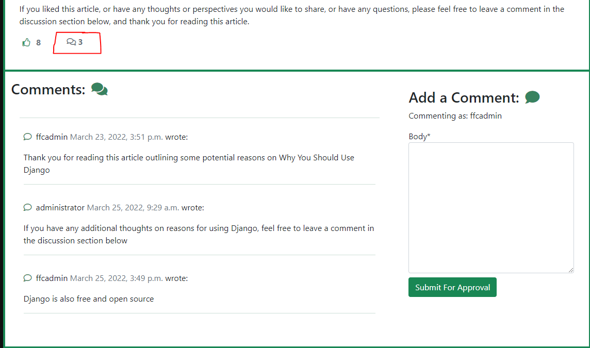

### - Administration Area
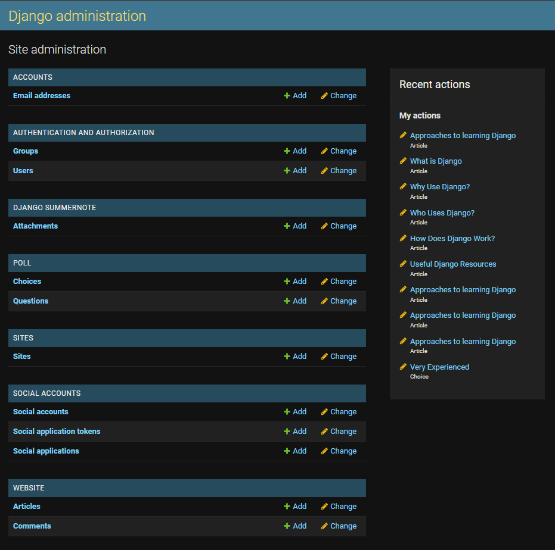

### - Add an article
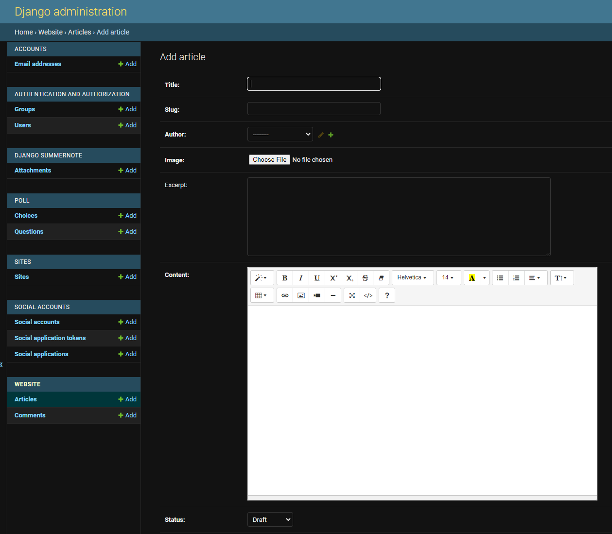

### - Edit an article

### - Delete an article

### - Approve a comment

### - Delete a comment

## Future Features 
In addition to the existing features there are several additional features which can be added to augment the application in future and are yet to be implemented:

### - Notifications

A future feature for site implementation would be the addition of a notifications choice for users. This would allow users who wish to avail of the option to receice notifications when a new article is posted to the site, and/or when their comments have had replies in the discussion areas. This feature is currently out of scope due to project deadlines, but will hopefully be added at a future time to improve the User Experience and broaden the suite of features offered by the site.

### -  Membership Tiers Addition

This would involve adding functionality to the site whereby existing users have the choice to upgrade their account to a "Premium Member" - which would in turn give them access to additional premium features not accessible to a default user. 

### - Premium articles & Analysis

Following on from the Mmeber's area would be additional members-only articles, and access to player data & analysis to help premium members gain an edge with their fantasy football management. This would require changes to existing models, and the addition of new models and in the interest of project deadlines is currently out of scope for the current release.

### - Forgotten Password Functionality

This would give users the ability to reset their password should they wish to do so in the event of forgetting their existing login credentials, thereby improving the User Experience and adding a further dimension to the functionality of the site

### - Social Media Sign-ins

The addition of the ability to sign-in via a user's existing social media account/s (Google, Facebook, Instagram etc) would add further functionality to the site and broaden the User Experience, however in the interests of project timelines this set of features is currently out of project scope for the current release.

# Testing

## User Workflow Testing:
Test Case | Expected Result | Actual Result | Pass/Fail
 ------------- | ------------- | ------------ | ------------- 
  Register an account | Expected result | To be tested | TBD
  Sign in | Expected result | To be tested | TBD
  Open an article | Expected result | To be tested | TBD
  Post a comment | Expected result | To be tested | TBD
  Like an article | Expected result | To be tested | TBD
  Unlike an article | Expected result | To be tested | TBD
  Close an article | Expected result | To be tested | TBD
  Sign out | Expected result | To be tested | TBD

## Admin Workflow Testing:
Test Case | Expected Result | Actual Result | Pass/Fail
 ------------- | ------------- | ------------ | ------------- 
  Create an article | Expected result | To be tested | TBD
  Delete an article | Expected result | To be tested | TBD
  Approve a comment | Expected result | To be tested | TBD
  Reject a comment | Expected result | To be tested | TBD
  Add an email address | Expected result | To be tested | TBD
  Verify an email address | Expected result | To be tested | TBD
  Add a user | Expected result | To be tested | TBD
  Delete a user | Expected result | To be tested | TBD
  Change a password | Expected result | To be tested | TBD
 

# Bugs

## Resolved Bugs

### Connection Refused - Error code 111

This bug was initially present when trying to sign-up a new user for an account after providing the user's email & password details. 

The error is caused when an email Backend is missing from the Settings.py file, and has been solved by adding the email backend and the default "from" email using the following code:

- `EMAIL_BACKEND = 'django.core.mail.backends.console.EmailBackend'`
- `DEFAULT_FROM_EMAIL = 'your choice of email'`

In keeping with the Agile methodology I am using to manage this project, the issue has now been moved to "closed" in Github's issues tracker:

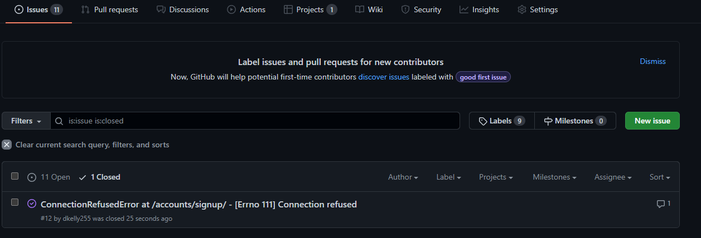

## Unresolved Bugs

An additional bug is currently present where the CSS styles are not being properly applied in the live deployed (Heroku) site. 

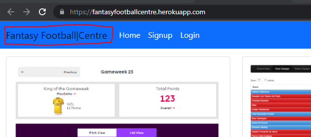

The styles are correct in the Development Environment (Gitpod) site:

This bug is currently under investigation for resolution

# Technologies Used

## - Cloudinary
## - Crispy Forms
## - Summernote
## - APIs & Configuration

# Deployment
The application was deployed via Heroku, and a link to the live deployment can be found by clicking [here](https://fantasyfootballcentre.herokuapp.com/)

An extended list of detailed steps & instructions for deployment is covered in the section below:

## Github Deployment
Note - please ensure you have created a GitHub repository prior to proceeding to the "Heroku" deployment section below to ensure no rework or deployment issues

## Heroku Deployment
The Steps for deployment to Heroku are as follows - Please note these steps are correct and current as at the time of application release (March 2022) but may be subject to change in future:

- Navigate to [Heroku](https://id.heroku.com/login) and create an account

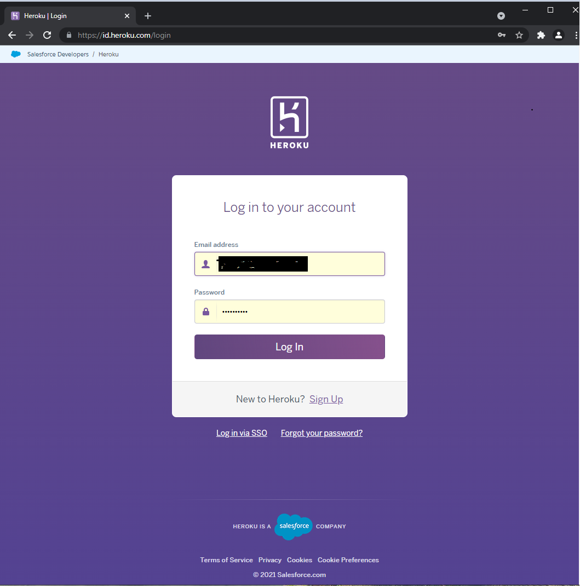

- From the Heroku dashboard select the “Create new app” button.

- Choose a name for the application - I have chosen Fantasy Football Centre but please note that the name must be unique.

- Select your region 

- Then click “Create app” - this will trigger a page with all the information for setting up the app.

Settings Tab:

- Config Vars - It is important to get your settings section done before you deploy  your code, the first section being the "config vars" - also known as "environment variables", are where sensitive data that needs to be kept private is stored. In the case of this website & app the  required "CLOUDINARY_URL", "DATABASE_URL", and "SECRET_KEY" config vars are shown below:

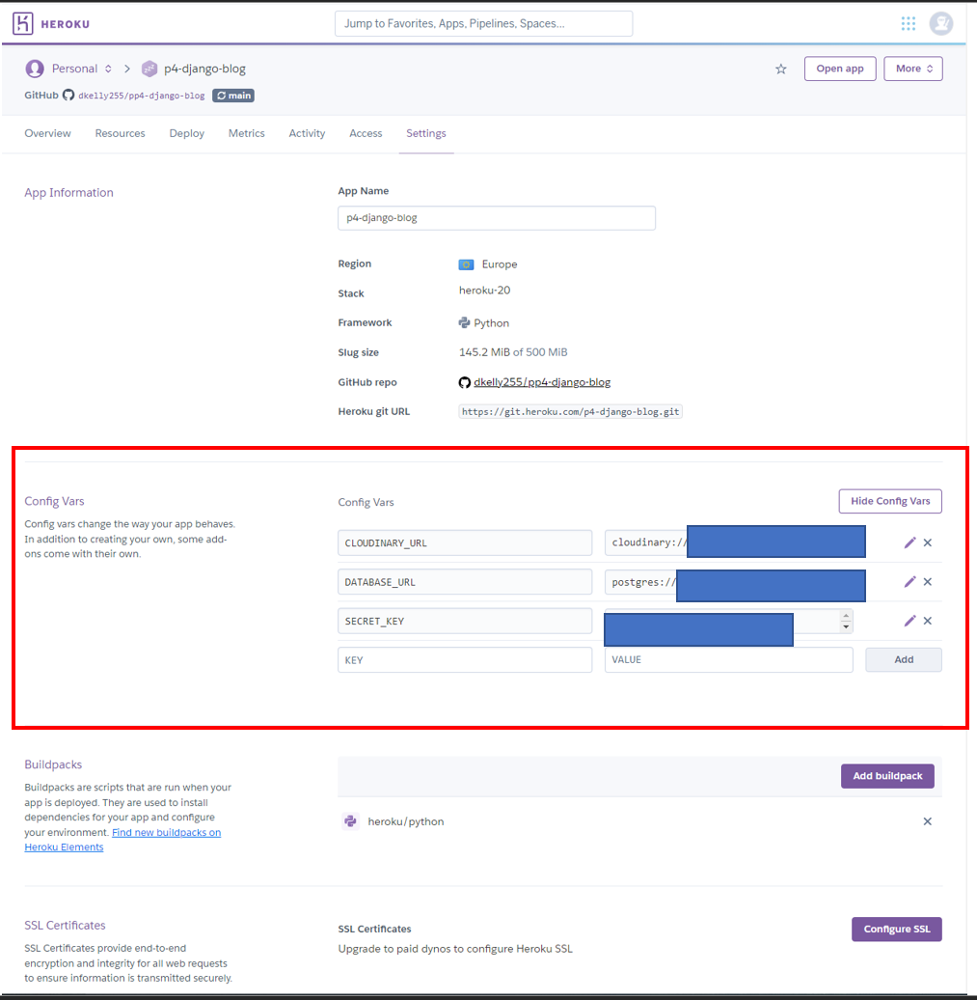

- Buildpacks - The next step is to add buildpacks - These install further dependencies that we need. Click “Add buildpack”, add the Python buildpack first and then click “Save changes”. 

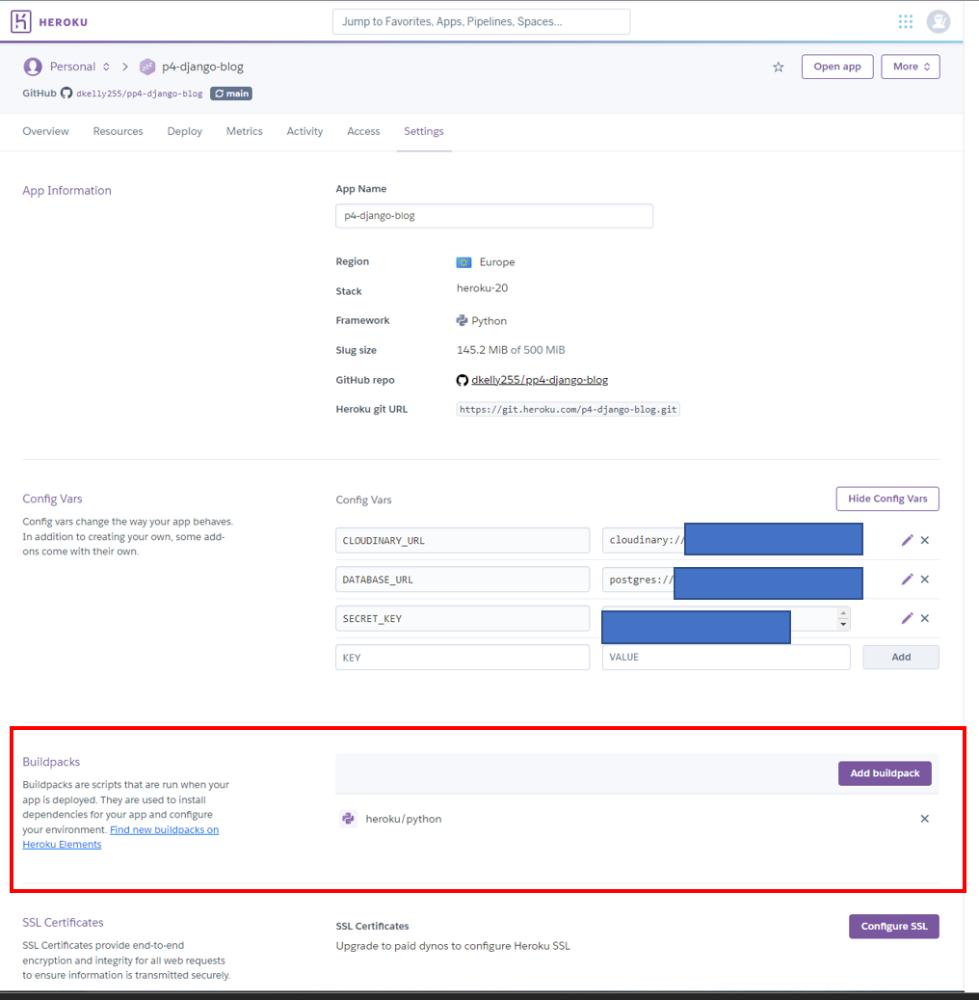

Deployment Tab: 

- Select Github here, and then we  can confirm that we want to connect to Github & search for the equivalent Github repository name, followed by “Search”. 

- Next, click “connect” to link up the Heroku app to our Github repository code, and scroll down to see two options - for manual or automatic deployment
- If you choose to enable automatic deployment then Heroku will rebuild the app every time you push a new change to your code in Github. 
- Alternatively you can choose to  manually deploy using the "deploy branch" option
- Finally, you will see the “App was successfully deployed” message  
and a button for the deployed link. 

## Local Deployment
Additionally - if you would like to make a local copy of the Github repository, you can clone it by typing the following command in your IDE terminal:

- `git clone https://github.com/dkelly255/fantasy-football-centre.git`

Alternatively, if you use Gitpod, you can click the button below to generate a new workspace using this repository.

# Credits
## Content
## Code
## Media

