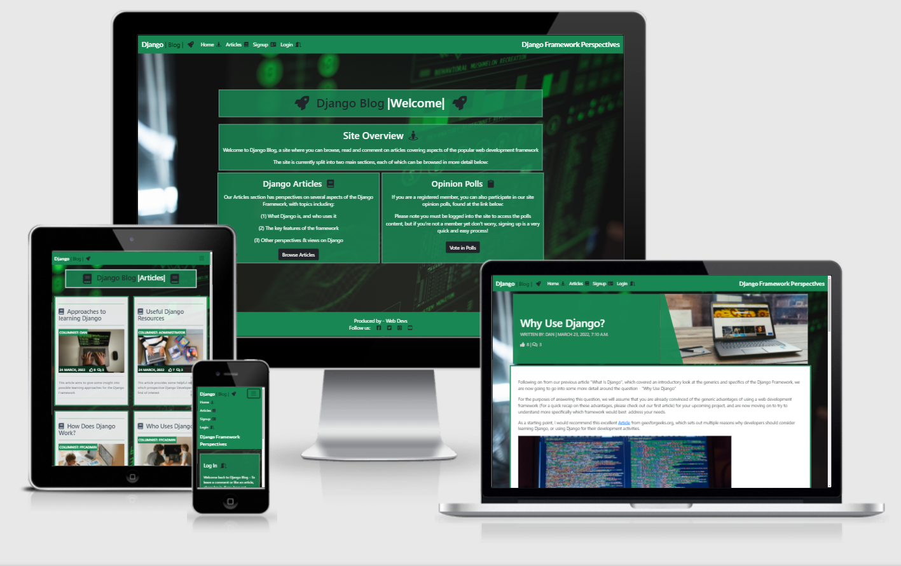
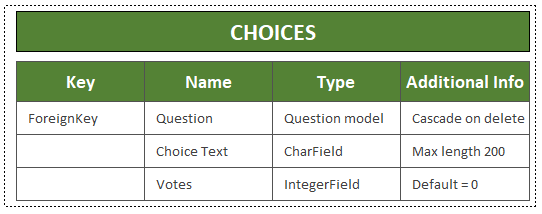
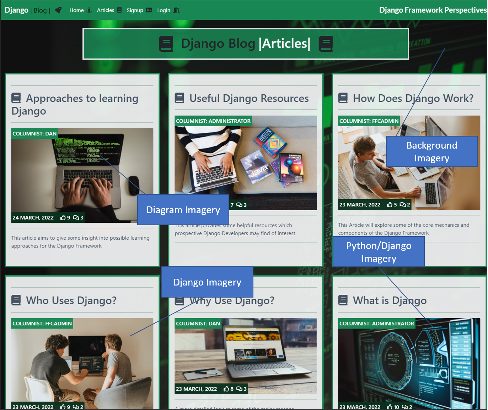
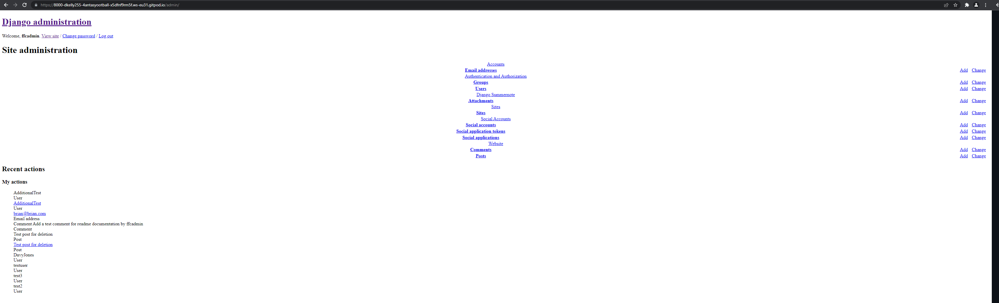
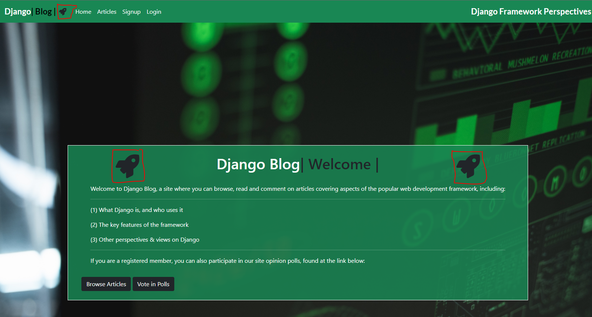
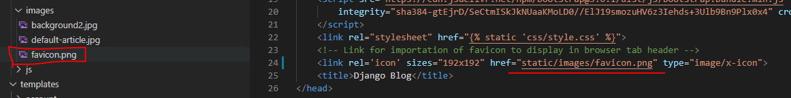
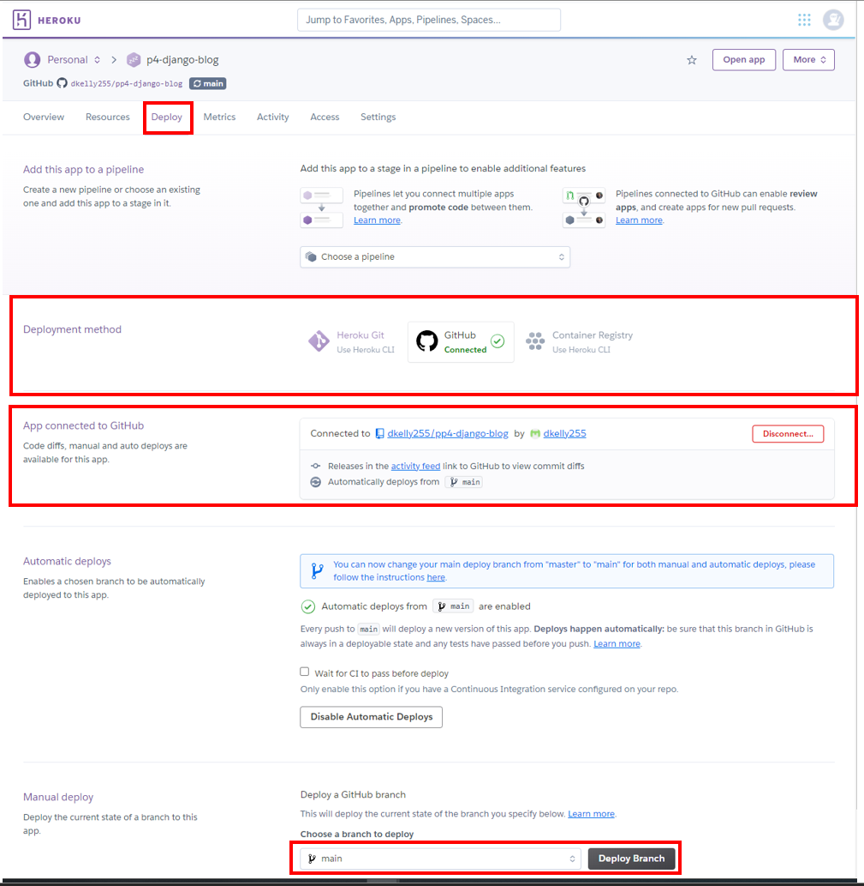

# Django Blog: README
Django Blog (Live deployment linked [here](https://p4-django-blog.herokuapp.com/)) is a fully-functioning, interactive Python & Django-based web application that allows users to browse, read, create their own account, and comment on articles covering key aspects and perspectives on the Django Web Development framework. Users can also choose to view and vote in opinion polls on important aspects of the site's content. 

In terms of having a clear, justified rationale for this real-world application, I wanted to build this project to house articles and content on the Django framework itself for two primary reasons: 

Firstly, the process of writing articles on various different aspects and perspectives on Django had the potential to be of huge benefit during my own learning experience & journey through understanding the Django Framework, what it is, how it works, who uses it and so forth.

And secondly, that the site would be of use to other Django-learners who are on a similar path to learning the framework, for example the article "How I am approaching learning Django" will be of benefit to others who are in similar cirucmstances in trying to learn & come up to speed on the Framework.




# SECTION 1: UX 
I have designed the site using the five planes of UX approach, each of which is reviewed in detail in the following sections
## 1. Strategy
The strategy for the site is to offer a resource to users interested in the Django framework where they can obtain content in the form of Articles, and can have the ability to post their own comments on the subject matter to engage in discussion within a broader community of Django users. 

The strategic aim of the site is to deliver the following **Epics**:

1. Epic 1 - Create a Blog Website App to allow users to locate, display, like and comment on articles about Django
2. Epic 2 - Create a Poll App to allow users to express their preference and opinions on topics relevant to the Website App content

With these two broad epics as the overall strategic goal of the project, we are then able to refine the epics into the following **User Stories**:

### **Epic 1 - Blog Website App - User Story Mapping:**

### *As a site user I can:*
- Create and register for an account so that I can add my own comments and likes to the articles and content
- View a list of the site's articles so that I can select one to read
- View an organised list of articles so that I can select which article I wish to view
- Open an article so that I can read the full content
- Add my own comments to articles so that I can join in the discussion on current Django hot topics and issues
- Add a like to an article so that I can provide my opinion on the content
- Remove a like from an article so that I can correct the record if I have mistakenly added a like

### *As a site administrator I can:*
- Have full CRUD (Create, Read, Update, Delete) abilities so that I can manage the content of the blog website app
- Create draft articles so that I can complete the articles at a later time
- Approve or reject comments so that I can ensure no unacceptable comments are posted on the site

### *As both a site user and administrator I can:*

- View a count of likes on each article so that I can guage general user sentiment on the site content
- View other user's comments on articles so that I can understand other site user's perspective's an opinions on the content

### **Epic 2 - Poll App - User Story Mapping:**

### *As a site user I can:*

- View a list of the site's opinion poll questions so that I can view the issues being polled
- View a list of the opinion poll question answer choices so that I can assess which answer best fits my perspective
- Vote my own preference to an opinion poll question so that I can have my opinion counted in the poll

### *As a site administrator I can:*
- Have full CRUD (Create, Read, Update, Delete) abilities so that I can manage the content of the poll app
- Create draft polls so that I can complete the poll at a later time

### *As both a site user and administrator I can:*

- View the current voting results status of an opinion poll question so that I can assess user sentiment on polled issues

## 2. Scope

To deliver the scope of the project, an Agile approach to Software Development has been pursued for the project implementation. There are many useful resources available giving context and perspectives on the advantages of an Agile Software Development practice - including the [Agilemanifesto.org](https://agilemanifesto.org/) and [Agilealliance.org](https://www.agilealliance.org/agile101/) which are good starting points, and summarise Agile Software Development as "Individuals and interactions over processes and tools, Working software over comprehensive documentation, Customer collaboration over contract negotiation, and Responding to change over following a plan" 

There are many principles and features common to Agile approaches, including, Scrums, Sprints, and Kanban boards - I am currently managing the project scope via multiple kanban boards using Github's built-in Kanban board functionality, with a board for managing the delivery of user stories, and a board for managing the bugs & debugging exercises through the development lifecycle. And work through daily sprints in taking each of the tasks through their stages of completion:

A view of the Kanban board with the user stories having been brought through "To Do", "In Progress", and "Done" columns as follows:

### (i) Kanban Board 1 - User Stories [Link](https://github.com/dkelly255/pp4-django-blog/projects/1)


With the equivalent Kanban board for the debugging exercises having been brought through similar phases of completion including - "Not Assigned", "In Progress", and "Closed" columns as follows:

### (ii) Kanban Board 2 - Bugs & Debugging [Link](https://github.com/dkelly255/pp4-django-blog/projects/2)


If you wish to review the boards in more detail, please navigate to the [Projects](https://github.com/dkelly255/pp4-django-blog/projects) section of the Github repository, where you will find direct links allowing a deeper dive into the detail of [Kanban Board #1 (User Stories)](https://github.com/dkelly255/pp4-django-blog/projects/1) and [Kanban Board #2 (Bugs & Debugging)](https://github.com/dkelly255/pp4-django-blog/projects/2)

## 3. Structure

The website is structured using the Django Framework functionality, with a home page, an articles page, a login option, and a signup page. The home page greets the visitor with a welcome message and links to the the main content of the site, the articles page houses the Django Articles, together with the comments that have been posted by other users/viewers.

The core website data  will be stored in Heroku's PostgreSQL add-on, and website static files and media/images will be stored on the Cloudinary Platform. I have made the decision to store website images on Cloudinary rather than Heroku due to the fact that Heroku is an ephemeral file system, and the Dyno system it utilizes can cause problems in situations where the project has been idle or if it has not been accessed for a certain length of time. Cloudinary is a persistent file store, and will therefore minimise the likelihood of such issues occurring and interrupting or deteriorating the User Experience, ensuring site visitors have less chance of seeing broken image links when browsing the site. In terms of the Cloudinary design choice, it is also less complicated to setup than other persistent file stores (such as Amazon S3 or Microsoft Azure) so will fit well for the scope of this project.

## Code Structure

### - *Model, View, Template*

Generically the project is structured using the "Model, View, Template" software design pattern. 

- The Model supports with database management, being a data access layer which primarily handles data. 
- The Views are used toe xecute the business logic and interact with the model to carry data and render a template
- The Templates are the presentation layers, which handle the User Interface aspects of the application.

The diagram below (sourced from [javatpoint.com](https://www.javatpoint.com/django-mvt)) illustrates the MVT structure & control flow used for this project:


### - *Requirements.txt* 

The project structure includes a requirements.txt in keeping with Python Standards & best practices - as per this overview from [idkrtm.com](https://www.idkrtm.com/what-is-the-python-requirements-txt/), the requirements.txt file is used for specifiying which Python packages are required to run the overall project.

The current packages and dependencies list for the project are shown below:


### - *Procfile*

A Procfile is also an integral element of the project structure - as per the overview in [medium.com](https://medium.com/@bennettgarner/deploying-django-to-heroku-procfile-static-root-other-pitfalls-e7ab8b2ba33b) - the Procfile is a file in the project's root directory that tells Heroku how the application should start and run - in this case, via a Gunicorn server.


## Database Structure & Schema

### 1. Website App

The website app's content will utilise a simple database structure, consisting of two main models - one for the Articles about Django topics, and one for the comments that users can add to those articles

The Entity Relationship Diagram for the Articles Table is shown below, with the field names, types, and key status. 

Note the Foreign Key will be the "Author" field, and that the "Likes" field will also need to have a many to many relationship:


The Entity Relationship Diagram for the Comments Table is shown below, with the field names, types, key status, and additional information. 

Note the Foreign Key will be the "Post" field, and that this will need to cascade on delete, so that when a post is removed, the comments on that post are also removed, that is, the deletion is cascaded through the models.


### 2. Poll App

The poll app's content will also be implemented via a relatively simple database structure, consisting of two main models - one for the Poll Questions, and one for the choices that users can vote for under each of these questions

The Entity Relationship Diagram for the `Questions` Table is shown below, with the field names, types, and key status:


The Entity Relationship Diagram for the `Choices` Table is shown below, with the field names, types, key status, and additional information. 

Note the Foreign Key will be the "Question" field, and that this will need to cascade on delete, so that when a Question is removed, the choices for that question are also removed, that is, the deletion is cascaded through the models.



### - Project Directory Renaming

Please note - I originally started this project as a Fantasy Football Content website but during development it has subsequently evolved into a blog about Django - primarily due to the quantity of content and material I was researching in relation to learning the framework, I found that writing articles about Django helped contribute to, and accelerate, the learning process. 

Whilst it was not critical to the application's functionality, from a completeness perspective, and from a learning-experience perspective, I wanted to understand how the process of renaming a Django project would work if it were to be undertaken, and what the potential pitfalls would be. 

Through consultation with our fortnightly Group Stand-Up facilitator, and from watching the linked [How To Change The Name Of A Django Project](https://www.youtube.com/watch?v=ko83PEvotNI&t=1s) instructional video from [Master Code Online](https://www.youtube.com/channel/UCbhm6TbMBTWn_GxrIbPFapA), I was able to succesfully rename the project, across all elements of the directory structure, and the Heroku deployment. A snapshot of some of the key aspects of mapping exercise I undertook to succesfully rename the project directory structure is illustrated below:


### - Production Database - PostgreSQL:

The database system used for the models in production is an application known as [PostgreSQL](https://www.postgresql.org/). 

As illustrated in this overview at [postgresqltutorial.com](https://www.postgresqltutorial.com/what-is-postgresql/) - PostgreSQL is an advanced, enterprise-class, open-source relational database system, which supports both relational querying, and is compatible with most popular programming languages (including Python) and is therefore ideal for the requirements of this project.

### - Development Database - SQLite3:

The database system used for the models in testing and development is an application known as [SQLite3](https://www.sqlite.org/index.html). 

As illustrated in this overview at [Python.org](https://docs.python.org/3/library/sqlite3.html) - SQLite3 a C library that provides a lightweight disk-based database that doesn’t require a separate server process and allows accessing the database using a nonstandard variant of the SQL query language, and is typically used in Django Applications for testing & development.

Note - for more information, please see the `Testing` and `Bugs` readme sections for more detail on the two databases - SQLite3 and PostgrSQL and changing between the two.

### - Crispy Forms

The project structure also utilises an application known as [CrispyForms](https://django-crispy-forms.readthedocs.io/en/latest/) to enable controlling the rendering behaviour of the key forms within the application.

As per this overview article at [merixstudio.com](https://www.merixstudio.com/blog/django-crispy-forms-what-are-they-about/) Django-crispy-forms is an application that helps to manage Django forms and allows adjusting forms' properties (such as method, send button or CSS classes) on the backend without having to re-write them in the template.

### - Summernote

Summernote is used as an editor for the article functionality within the site. The Summernote [website](https://summernote.org/) contains comprehensive & useful documentatino on the editor - for the purposes of this project's structure - it is used as a "WYSIWYG" (What You See Is What You Get) editor, due to it's simple & easy-to-use nature.

## 4. Skeleton

The wireframes below illustrate the skeleton of the site, including the home page, login page, signup page, together with the various nav bars and footers that underpin the site structure:

- Wireframe 1 - Home Page


- Wireframe 2 - Article detail & comments 


- Wireframe 3 - Signup Page


- Wireframe 4 - Login page


- Wireframe 5 - Administration page


## 5. Surface

I have used the Bootstrap framework to build the Surface of the website, with the following design choices helping to deliver the optimum user experience:

- Typography

For the Fonts on the site I am primarily using [Roboto](https://fonts.google.com/specimen/Roboto?query=roboto) for site content - As per the overview on Google Fonts [linked](https://fonts.google.com/specimen/Roboto?query=roboto), Roboto has a dual nature, with a mechanical skeleton and the forms are largely geometric. At the same time, the font features friendly and open curves. While some grotesks distort their letterforms to force a rigid rhythm, Roboto doesn’t compromise, allowing letters to be settled into their natural width. This makes for a more natural reading rhythm more commonly found in humanist and serif types.


The [Lato](https://fonts.google.com/specimen/Lato?query=lato) font is also used - and is a sans serif typeface family started in the summer of 2010 by Warsaw-based designer Łukasz Dziedzic (“Lato” means “Summer” in Polish):


- Imagery

I am using Django related imagery throughout the Surface layer of the site, to help with promoting a positive User Experience for the target audience. The imagery is primarily consisted of different Django-related pictures & diagrams. The site's background image is also selected due to it's relevance to coding, and having a similar color palette that matches with the site's surface. The background image was sourced from [pexels.com](https://www.pexels.com/) and is fully acknowledged in the credits section of this readme document. Some examples of the site imagery are shown below:



- Color Palette

As part of the surface layer of the website's user experience, I wanted to use a green color palette as part of the site's theme - Bootstrap has a large array of color-schemes & themes to choose from, illustrated in the screenshot below:


A deeper dive on the Green color scheme allows many different shades, hues, and opacities depending on the user's needs, for themajority of the site's surface I am using the default shade of green (code #198754 & its' derivations) - shown below:


- Iconography

I have utilised the functionality available through the [Fontawesome](https://fontawesome.com/) suite to embed the site's icons, this helps emphasise important elements of the site, and to help with generating a positive emotional response with the site users. 

Additionally I have added a favicon, which displays at the top of all the site's pages via the head element of the HTML to help with the User Experience & create a professional feel when browsing:
    


# SECTION 2: FEATURES

Due to the extended length of the features sections for the application, I have broken the following sections of the Features content out into a separate markdown file, with links contained in the table below. 

Please navigate to the linked locations below to view a more detailed walkthrough of the features, both existing and future, and covering the core CRUD functionality of the application:

Section: | Features Documentation:  | 
  ------------- | ------------- | 
 1 | [**Authentication, Authorisation & Permission Features**](https://github.com/dkelly255/pp4-django-blog/blob/main/FEATURES.md#features) | 
 2 | [**CRUD Features**](https://github.com/dkelly255/pp4-django-blog/blob/main/FEATURES.md#features) | 
 3 | [**Other Key Existing Features**](https://github.com/dkelly255/pp4-django-blog/blob/main/FEATURES.md#2-other-key-existing-features) | 
 4 | [**Future Features**](https://github.com/dkelly255/pp4-django-blog/blob/main/FEATURES.md#3-future-features)

# SECTION 3: TESTING

In an effort to keep the readme documentation as streamlined & structured as possible, the testing approaches & results for the application are contained in a separate markdown file, stored in the [testing](https://github.com/dkelly255/pp4-django-blog/blob/main/TESTING.md) location contained in the [link](https://github.com/dkelly255/pp4-django-blog/blob/main/TESTING.md) attached

Please navigate to this section for an in-depth analysis & overview of the code validation, code testing processes & procedures, and the testing results for all end-to-end aspects of the application & functionality.

# SECTION 4: BUGS

## Resolved Bugs

### 1. Connection Refused - Error code 111

This bug was initially present when trying to sign-up a new user for an account after providing the user's email & password details. 


The error is caused when an email Backend is missing from the Settings.py file, and has been solved by adding the email backend and the default "from" email using the following code:

- `EMAIL_BACKEND = 'django.core.mail.backends.console.EmailBackend'`
- `DEFAULT_FROM_EMAIL = 'your choice of email'`

In keeping with the Agile methodology I am using to manage this project, the issue has now been moved to "closed" in Github's issues tracker:


### 2. Notification Messages glitch when creating an account

The original code for the messages functionality unfortunately contained a bug which would cause the `confirmation email sent` message to stay on the screen until a user changed pages, as illustrated in the screenshot below:


This bug was caused by an error in the original Javascript code for the messages functionality illustrated in the code block below:
```
setTimeout(function () {
            let messages = document.getElementById('msg');
            let alert = new bootstrap.Alert(messages);
            alert.close();
        }, 2500);
```

This code would operate correctly in situations where only a single message would be displayed/removed - but would not remove more than one message due to the use of the `document.getElementById('msg)` Javascript selector (which will select a singular element with iterating over multiple messages in scenarios where multiples exist).

Through working with my mentor I was able to debug and resolve the issue by updating my code to use a multiple element selector `document.querySelectorAll()` and iterating over multiple messages in scenarios where multiples exist, updating the Javascript function to reflect the below structure:

```
setTimeout(function () {
            let messages = document.querySelectorAll('.alert');
            messages.forEach(message => {
                let alert = new bootstrap.Alert(message);
                alert.close();
            });
        }, 2500);
```

Which now ensures multiple messages will disappear in situations where they are displayed - the issue has also been closed in the Agile Methodology Issue Tracker in Github

### 3. Failure to Run Test Script
Initially when starting my development of automated testing I encountered the below error in the command line when trying to start the test script:


Through researching on debugging this error and working with Code Institute Tutor Support, I discovered that this was due to the database connection - Automated testing must take place in the SQLite database, whereas my project was connected to the PostGreSQL database. 

The solution was to disconnect my project from the production database, and connect to the test database by changing my `DATABASE` variable in `settings.py` from:

```
DATABASES = {
    'default': dj_database_url.parse(os.environ.get("DATABASE_URL"))
}
```
to the updated variable below:

```
DATABASES = {
    'default': {
        'ENGINE': 'django.db.backends.sqlite3',
        'NAME': BASE_DIR / 'db.sqlite3',
    }
}
```

This succesfully resolved the bug and enabled proceeding with the development of the automated testing activties detailed in the "Testing" section of the readme.

### 4. Poll app questions displaying in reverse order

Upon first building the poll app, I noticed that the questions were appearing in reverse order:


 Whilst this was technically not impacting the operation of the site, I found that it was not the optimal User Experience, and wanted to have the questions displaying in numbered sequence. As per the credits section, I had originally used the [official Django Documentation](https://www.google.com/search?q=django+tutorial&oq=django+tutorial&aqs=chrome.0.69i59j0i512l2j69i60l3j69i65l2.1632j0j7&sourceid=chrome&ie=UTF-8) tutorial to develop the poll application, and after researching and troubleshooting I found that this was due to the reverse operator included in the `get_queryset()` method of the `IndexView()` class-based view in `poll/views.py`

By removing the reverse operator from the code, I was able to succesfully resolve the bug, and have the question list display in sequential order, improving the user experience in the process:


Note this bug subsequently also caused a knock-on impact which I did not catch until re-running my automated tests later in the development process - and required an update to my `Automated Testing` for this view, specifically the [`test_two_past_questions(self):`](https://github.com/dkelly255/pp4-django-blog/blob/main/TESTING.md#ii-testing-the-polls-view-indexview) test. 

Originally i had setup the test as follows:

```
def test_two_past_questions(self):
        """
        The questions index page may display multiple questions.
        """
        question1 = create_question(question_text="Past question 1.", days=-30)
        question2 = create_question(question_text="Past question 2.", days=-5)
        response = self.client.get(reverse('poll:index'))
        self.assertQuerysetEqual(
            response.context['latest_question_list'],
            [question2, question1],
        )
```

However, as I had now updated the view to change the sequential order of the questions, my test would now fail with an assertion below:

```
AssertionError: Lists differ: [<Question: Past question 1.>, <Question: Past question 2.>] != [<Question: Past question 2.>, <Question: Past question 1.>]

First differing element 0:
<Question: Past question 1.>
<Question: Past question 2.>

- [<Question: Past question 1.>, <Question: Past question 2.>]
?                           ^                             ^

+ [<Question: Past question 2.>, <Question: Past question 1.>]
?                           ^                             ^
```

Through troubleshooting and using the `Rubber Duck` method, I was able to retrace my steps through all elements of my code & determine that in order to get the automated test apssing again I simply required an update to the question sequence in the test to the below:

```
question1 = create_question(question_text="Past question 1.", days=-5)
question2 = create_question(question_text="Past question 2.", days=-30)
```

In keeping with the Agile development methodology used to deliver this project, the bug has been documented and closed on the Kanban board & issue tracker in github, as well as this readme document.

### 5. Admin Panel display formatting errors

During development, the Administration panel display developed a bug where the standard formatting would not apply and the panel was close to unreadable as a result:



This bug may also have been caused by a combination of the debug flag and other settings in `settings.py` - as since updating the debug flag in `settings.py`, the admin panel has displayed properly, I have been unable to recreate this error and the bug has not reoccurred. As in keeping with the Agile development methodology used to deliver this project, the bug has been documented and closed on the Kanban board & issue tracker in github, as well as this readme document.

### 6. Unauthorised users permitted to access Polls App

The initial build of my poll application included a bug which enabled a user who was not logged in (and therefore unauthorised and unathenticated) to be able to access the polls application via manually adding `/poll` to the end of the homepage URL:


As part of completing the [Django Tutorial](https://www.youtube.com/watch?v=3aVqWaLjqS4&list=PL-osiE80TeTtoQCKZ03TU5fNfx2UY6U4p&index=7) series from [Corey Schafer](https://www.youtube.com/channel/UCCezIgC97PvUuR4_gbFUs5g) I was able to understand that we can add authorisation & authentication controls to a class-based view by importing a `LoginRequiredMixin` from `django.contrib.auth.mixins`, and including it in the view for the relevant class. 

Upon taking these actions, and importing/adding the `LoginRequiredMixin` from `django.contrib.auth.mixins` to the `IndexView` class in `poll/views.py`, the bug was succesfully resolved, and a non-logged-in user is now re-routed to the `signin` page if trying to circumvent access controls via manual manipulation of the address bar & URL:


I have also added the `LoginRequiredMixin` to the other appropriate views in `poll/views.py` (`DetailView` and `ResultsView` respectively) to prevent similar bugs from being present in the application. Note however, as you will see later in this document, per [Bug #10](https://github.com/dkelly255/pp4-django-blog#4-poll-app-test-failures) and my [Automated Testing](https://github.com/dkelly255/pp4-django-blog/blob/main/TESTING.md#ii-testing-the-polls-view-indexview) of the Poll App's `IndexView` - this code-change inadvertently created a latent knock-on impact of failing my original automated testing for multiple question displays, which later necessitated further debugging, re-testing and a test code update to keep the code from failing the tests. (This is detailed further in Bug#10 towards the end of the bugs section below)

 As per the Agile development methodology used to deliver this project, this bug has been documented and closed on the Kanban board & issue tracker in github, as well as this readme document.

### 7. Fontawesome Icon Display Bugs

During the surface plane development process, I encountered a bug whereby the fontawesome icons I wanted to use would not display properly on the site. Following the fontawesome instructions led to the display errors below:


Debugging this issue, I found that by going back to check my previous projects, it looks like there now is an error in the element code specified on the Fontawesome website for embedding the icons. The fontawesome direction is below, where we are instructed to use the code `<i class="fa-solid fa-rocket"></i>` to embed the icon:


However, this code does not work, and instead the code `<i class="fas fa-rocket"></i>` must be used. Upon updating the element code, the bug is resolved, and the icons will display correctly:



### 8. Heroku Javascript/Static File bug - messaging

When breaking out my javascript code into a separate file `base.js` to keep separate from my `base.html` template, I encountered a bug where the mesage functionality would continue to behave as expected in the development server/githubport-8000 browser, but would behave differently in the Heroku deployment. Specifically, the notification messages would appear as expected in Heroku, but would not disappear again despite being specified to do so by the javascript code in `base.js` via the code below:

```
<script src="../static/js/base.js"></script>
```

Through working to debug & understand this issue with Code Institute Tutor Support I discovered that this was due to the fact that I had failed to use the jinja templating syntax when detailing the `source` attribute of the `script` element linking to my `base.js` file. Due to Django's inability to serve static files in *production* (as opposed to development), the hardcoded relative file path link would not be served in production - creating the situation where the app appeared to function as expected in the development environment, but would glitch in the production/heroku deployment.

Updating the code to reflect the Jinja templating syntax per the code block below has resolved the issue, and the live heroku deployment messaging functionality now behaves as expected. I have closed the bug on the kanban tracker:

```
<script src="<script src=""></script>"></script>
```
### 9. Missing Alt Texts on Cloudinary images

During my [accessibility testing](https://github.com/dkelly255/pp4-django-blog/blob/main/TESTING.md#6-accessibility-testing) activities, the `post_detail.html` page would continually receive below 90% accessibility scores from Lighthouse audits due to missing `alt text` tags on image elements.

In my first attempts at improving initial accessiblilty, I had performed a thorough scrub of all `.html` templates and `img` elements, ensuring that the `alt` attributes were all present, however I would still receive the `images missing alt text` warnings below:


The images driving the missing `alt` attributes warnings were actually the images uploaded to Cloudinary as part of creating the articles, and therefore were not reachable by templating or injection via jinja tags. 

Through researching how to resolve this I eventually discovered that the solution was to add the `alt` tags indirectly through the `Cloudinary` interface, shown in the screenshot below:


However, this still would not allow the alt text to dial through into the Django html - further research on this issue led me to believe that an API will be required (Cloudinary's [Get Single Resource](https://cloudinary.com/documentation/admin_api#get_the_details_of_a_single_resource) API) as per this [section](https://cloudinary.com/blog/m16y_make_your_cloudinary_images_more_accessible#setup_and_retrieval_of_alt_text_with_api) of Cloudinary's documentation.

This bug remained opened for quite some time, and in keeping with an Agile software development methodology, and considering that the accessibility deficiency was understood and acknowledged, and would not invalidate the majority of the site content, I decided to de-prioiritise this task in favour of other more project-critical activities which still require completion prior to deadline, with the intention of revisiting in future when time is less of a constraint.

Subsequently however, as part of a discussion in the [Accessibility Ally](https://code-institute-room.slack.com/archives/C037VP5A3FZ/p1648049020400839) channel on slack, we were able to determine that in fact the way to add the alt text was through the `wsiwyg` (What You See Is What You Get) editor's "Code" function - which allowed directly adding alt attributes into images uplaoded via the Summernote text editor per the screenshot below:


This allowed the accessibility scores to hit close to 100% on all pages again and successfully resolved the bug, which has now been closed on the kanban tracker. 

### 10. Poll App Test failures

After introducing valuable authentication & authorisation features to my Polls app via the `LoginRequiredMixin`, it transpired that my original set of automated testing for the Polls app would no longer pass - primarily due to the inability of the tests in their current form to navigate the added defensive design features of authentication & authorisation. See screenshot of the errors and warnings below:


Through spending time researching & debugging this issue across Stack Overflow and the Code Institute Slack Channels, I was able to determine that my tests required login credentials in order to succesfully pass the newly introduced Authentication. By adding the code in the block below to my tests, together with the required import statements from the correct libraries, I was able to update my tests to succesfully pass again:

```
test_user = User.objects.create_user(
    username='testuser', password='testpw'
    )
self.client.login(username='testuser', password='testpw') 
```

In keeping with the Agile Development approaches being used to deliver this project, this issue has been documented and closed on the Bugs Kanban Board in the Projects section of Github.

### 11. Favicon Display Bugs

Initially I encountered a bug in the development server/port8000 view of my application, after adding the favicon to the `base.html` template, in that the favicon would only display on the `landing_page.html` (home page) and would not display on any of the other site pages. I discovered this was due to the way I had structured the path link to the favicon, as I had not used the proper file path notation:



When updating my file path from the above to the below, this resolved the initial issue, and the favicon started to appear on all site pages as intended:


However, the favicon bugs still existed when I tried to view the site in the production environment/Heroku, and the favicon would not display on *any* pages. Through further research, debugging, and trial and error, I discovered that this was due to the way I had approached the favicon addition - where I had stored the favicon in my static images folder, I actually needed to use the Cloudinary link, as this was where my images were being served to Heroku. Upon updating my favicon location link to the below, this succesfully resolved the issue and closed the bug:


### 12. Comment submission duplication on page refresh

When viewing the `article_detail.html` template on both the development and production servers, I encountered a bug whereby in the (admittedly unlikely, but possible) scenario where a user submits a comment for approval, and then attempts to refresh the page they are viewing before an administrator has approved the comment, and approves the popup `Confirm Form Resubmission` warning notification (highlighted below) the comment will resubmit for approval in the administration area. 

This unfortunately would create multiple versions of the same comment pending approval in the back-end in a situation where a user either intentionally or unintentionally refreshes the page multiple times while their submitted comment is in unapproved status. 

The screenshot below illustrate the nature of this issue in the front end and backend views:


Through researching errors of this nature on both Stack Overflow and the Django documentation, and through working with Tutor Support, I was able to locate a good resource which helped resolve the problem at [WebTricksHome.com](https://www.webtrickshome.com/forum/how-to-stop-form-resubmission-on-page-refresh) determine that this was being caused by the form's resubmission on refresh, and that a possible solution was to use Javascript to block the popup asking for the resubmission - by adding the following Javascript to my `article_detail.html` template:

```
<script>
    if ( window.history.replaceState ) {
      window.history.replaceState( null, null, window.location.href );
    }
</script>
```

Implementing the Javascript approach has resolved the issue with duplicate comments and the bug has now been closed on the Bugs Kanban.

## Unresolved Bugs

There are no known unresolved bugs in this release of the application

# SECTION 5: DEPLOYMENT

The application is deployed via Heroku, and a link to the live deployment can be found by clicking [here](https://p4-django-blog.herokuapp.com/)

An extended list of detailed steps & instructions for deployment is covered in the section below:

## Github Deployment
Note - please ensure you have created a GitHub repository prior to proceeding to the "Heroku" deployment section below to ensure no rework or deployment issues

## Heroku Deployment
The Steps for deployment to Heroku are as follows - Please note these steps are correct and current as at the time of application release (March 2022) but may be subject to change in future:

- Navigate to [Heroku](https://id.heroku.com/login) and create an account


- From the Heroku dashboard select the “Create new app” button.


- Choose a name for the application - I have chosen P4-Django-Blog but please note that the name must be unique.


- Select your region 


- Then click “Create app” - this will trigger a page with all the information for setting up the app.


Settings Tab:

- Config Vars - It is important to get your settings section done before you deploy  your code, the first section being the "config vars" - also known as "environment variables", are where sensitive data that needs to be kept private is stored. In the case of this website & app the  required "CLOUDINARY_URL", "DATABASE_URL", and "SECRET_KEY" config vars are shown below:


- Buildpacks - The next step is to add buildpacks - These install further dependencies that we need. Click “Add buildpack”, add the Python buildpack first and then click “Save changes”. 


Deployment Tab: 

- Select Github here, and then we  can confirm that we want to connect to Github & search for the equivalent Github repository name, followed by “Search”. 



- Next, click “connect” to link up the Heroku app to our Github repository code, and scroll down to see two options - for manual or automatic deployment
- If you choose to enable automatic deployment then Heroku will rebuild the app every time you push a new change to your code in Github. 
- Alternatively you can choose to  manually deploy using the "deploy branch" option
- Finally, you will see the “App was successfully deployed” message  
and a button for the deployed link. 

## Local Deployment
Additionally - if you would like to make a local copy of the Github repository, you can clone it by typing the following command in your IDE terminal:

- `git clone https://github.com/dkelly255/pp4-django-blog.git`

Alternatively, if you use Gitpod, you can click the button below to generate a new workspace using this repository.

[](https://gitpod.io/#https://github.com/dkelly255/pp4-django-blog)

Note, please ensure that you install all of the required dependencies and packages, this can be performed by entering the following command into the terminal, 

```
pip3 install -r requirements.txt
```

Also please ensure to have an environment file correctly setup (`env.py`) with the following variables - `DATABASE_URL` , `SECRET_KEY` , `CLOUDINARY_URL` , and `DEVELOPMENT`


# SECTION 6: CREDITS

## General Credits
As part of the development process for the site, I required guidance from a number of online Django Resources aimed at walking new users through the process of using the Framework. The three most utilised and useful tutorials which helped me come up to speed with Django were:
1. The [Official Django Documentation tutorial](https://docs.djangoproject.com/en/4.0/intro/tutorial01/) - a set of 7 tutorial stages which walk through building a poll app in Django step by step, from initial setup & installation, to completion

    Note I have also built this completed & fully functional poll app tutorial, the build can be found in my associated github repository: [Django Tutorial 1](https://github.com/dkelly255/Django-Tutorial-1)

2. The [Django Girls Tutorial](https://tutorial.djangogirls.org/en/), an excellent tutorial series, working on building a blog application from scratch and extending it via additional functionality, covering everything from initial installation, setup, virtual environments right through to completion of the blog. 

    This completed project build can be found in my associated github repository: [Django Girls Tutorial](https://github.com/dkelly255/django-girls-tutorial)

3. The [Corey Schafer Django tutorial series](https://www.youtube.com/watch?v=UmljXZIypDc&list=PL-osiE80TeTtoQCKZ03TU5fNfx2UY6U4p) - a series of 12x videos, around 7-8 hours in length again focused on building a blog application, but with much more functionality & features. 

    This completed project build can also be found in my associated github repository: [Corey Schafer Django Blog](https://github.com/dkelly255/CS-Django-Blog)

I also must acknowledge and highly recommend the [Official Django Forum](https://forum.djangoproject.com/c/users/6) - where I was able to receive help and support with several technical issues and queries when working through the process of building the official Django poll app tutorial with special recognition going to Django Forums' [KenWhitesell](https://forum.djangoproject.com/u/KenWhitesell) who was able to help me with several queries & issues I had whilst working through the official Django documentation. Below I have included links & acknowledgement to all of the discussion and content of the troubleshooting and debugging advice I was able to receive on these topics including :

1. How to solve a [404 Page not found error](https://forum.djangoproject.com/t/page-not-found-404-tutorial-1/12135/5)

2. Guidance on how to work through a [CSRF token verification failure](https://forum.djangoproject.com/t/tutorial-2-error-forbidden-csrf-verification-failed/12143)

3. How to locate files in [Django's source code & directories](https://forum.djangoproject.com/t/tutorial-7-base-site-html-location/12187/3)
    
4. Support with trying to resolve a [101 - Network Unavilable error](https://forum.djangoproject.com/t/oserror-at-password-reset-errno-101-network-is-unreachable/12348/2)

As part of the process of learning how to use Bootstrap, I must also highly recommended the linked [BootStrap Tutorial Series](https://www.youtube.com/watch?v=O_9u1P5YjVc&list=PL4cUxeGkcC9joIM91nLzd_qaH_AimmdAR) from the YouTube channel [The Net Ninja](https://www.youtube.com/channel/UCW5YeuERMmlnqo4oq8vwUpg). I found this series of 10+ tutorial videos to be hugely helpful in learning how to use Bootstrap to construct responsive, mobile-first designs and was able to utilise several ideas and techniques from the series in constructing my home page specifically, and the site generically.

## Content
- The "Model, View, Template" explanation in the "Structure" section of the User Experience overview is sourced from [javatpoint.com](https://www.javatpoint.com/django-mvt)
- In the "What is Django article", the [Official Django Documentation](https://www.djangoproject.com/), and the [Django Wikipedia Page](https://www.djangoproject.com/) are both used and accredited to provide article content
- In the "Who Uses Django" article, [instagram-engineering](https://instagram-engineering.com/what-powers-instagram-hundreds-of-instances-dozens-of-technologies-adf2e22da2ad), [dev.to](https://dev.to/developerroad/what-is-django-and-why-you-should-use-it-5a07), the [official Django documentation](https://www.djangoproject.com/weblog/2005/dec/08/congvotes/#:~:text=Django%20powers%20the%20entire%20votes,didn't%20break%20a%20sweat.), and [Django Stars](https://djangostars.com/blog/why-we-use-django-framework/), are used to provide content and context for the article
- The Features' section definition & context on Create, Read, Update Delete (CRUD) functionality was informed and accredited to [Sumologic.com](https://www.sumologic.com/glossary/crud/#:~:text=CRUD%20Meaning%3A%20CRUD%20is%20an,%2C%20read%2C%20update%20and%20delete.)
- The project renaming exercise detailed in the `structure` section of my UX overview was guided and informed by the [How To Change The Name Of A Django Project](https://www.youtube.com/watch?v=ko83PEvotNI&t=1s) instructional video from [Master Code Online](https://www.youtube.com/channel/UCbhm6TbMBTWn_GxrIbPFapA)
    

## Code
- The blog app (website folder in project directory) and project structure is based on the Code Institute [Blog lesson](https://learn.codeinstitute.net/courses/course-v1:CodeInstitute+FST101+2021_T1/courseware/b31493372e764469823578613d11036b/fe4299adcd6743328183aab4e7ec5d13/) project and has been adapted for my project needs
- The poll app (poll folder in project directory) is based on the [Official Django Documentation's](https://docs.djangoproject.com/en/4.0/intro/tutorial01/) introduction to Django tutorial and has been adapted for my project needs
- The Automated testing of the poll app is based heavily on the [Official Django Documentation's](https://docs.djangoproject.com/en/4.0/intro/tutorial05/) automated testing tutorials

## Media
- The site `background image` was sourced from [Pexels](https://www.pexels.com/photo/close-up-view-of-system-hacking-5380618/) and is free to use with no attribution required
- The `Default Article` image was also sourced from [Pexels](https://www.pexels.com/photo/person-holding-smartphone-while-using-laptop-1181244/) and is free to use with no attribution required
- The site fonts were taken from [Google Fonts](https://fonts.google.com/)
- All `Icons`, including the `Favicon` used throughout the site were sourced from [FontAwesome](https://fontawesome.com/)
- The Article [Image](https://www.pexels.com/photo/close-up-view-of-system-hacking-5380642/) for "What is Django" was taken from Pexels and is free to use with no attribution required
- The Article [Image](https://www.pexels.com/photo/gray-laptop-computer-109371/) for "Why Use Django" is a Photo by Monoar Rahman from Pexels
- The Article [Image](https://www.pexels.com/photo/two-men-looking-at-a-laptop-4974920/) for "Who Uses Django" was taken from Pexels and is free to use with no attribution required
- The Article [Image](https://www.pexels.com/photo/man-using-3-computers-4974914/) for "How Does Django Work" is a Photo by olia danilevich from Pexels
- The Article [Image](https://www.pexels.com/photo/person-using-macbook-pro-on-person-s-lap-1181298/) for "Approaches to learning Django" is a Photo by Christina Morillo from Pexels
- The Article [Image](https://www.pexels.com/photo/silver-imac-displaying-collage-photos-1779487/) for "Useful Django Resources" is a Photo by Designecologist from Pexels

https://www.pexels.com/photo/man-in-white-t-shirt-sitting-in-front-of-black-flat-screen-computer-monitor-6804604/ Photo by cottonbro from Pexels
https://www.pexels.com/photo/grayscale-photo-of-computer-laptop-near-white-notebook-and-ceramic-mug-on-table-169573/ Photo by Negative Space from Pexels
https://www.pexels.com/photo/silhouette-of-four-people-against-sun-background-862848/ Photo by Dennis Magati from Pexels
https://www.pexels.com/photo/man-in-white-shirt-using-macbook-pro-52608/ Photo by Tim Gouw from Pexels
Photo by Startup Stock Photos from Pexels: https://www.pexels.com/photo/person-s-hands-on-macbook-pro-7114/
Photo by ThisIsEngineering: https://www.pexels.com/photo/woman-sitting-in-front-of-computer-in-office-3861967/
Photo by Markus Spiske: https://www.pexels.com/photo/black-laptop-computer-turned-on-showing-computer-codes-177598/
Photo by Christina Morillo: https://www.pexels.com/photo/closeup-photo-of-silver-macbook-pro-on-table-1181269/
Photo by hitesh choudhary: https://www.pexels.com/photo/selective-focus-photography-of-man-facing-computer-340152/
Photo by hitesh choudhary: https://www.pexels.com/photo/turned-on-macbook-pro-693859/
Photo by RODNAE Productions: https://www.pexels.com/photo/person-holding-the-conference-program-7648031/
Photo by Tima Miroshnichenko: https://www.pexels.com/photo/close-up-view-of-system-hacking-5380792/
Photo by Mikhail Nilov: https://www.pexels.com/photo/man-people-night-dark-6963098/
Photo by Markus Spiske from Pexels: https://www.pexels.com/photo/green-and-white-line-illustration-225769/
Photo by cottonbro: https://www.pexels.com/photo/boy-in-white-shirt-sitting-in-front-of-computer-4709286/
Photo by Mikhail Nilov: https://www.pexels.com/photo/man-people-night-dark-6963098/
Photo by cottonbro: https://www.pexels.com/photo/man-in-black-leather-jacket-using-computer-8720586/
Photo by Sora Shimazaki: https://www.pexels.com/photo/crop-unrecognizable-developer-using-laptop-and-smartphone-5926389/