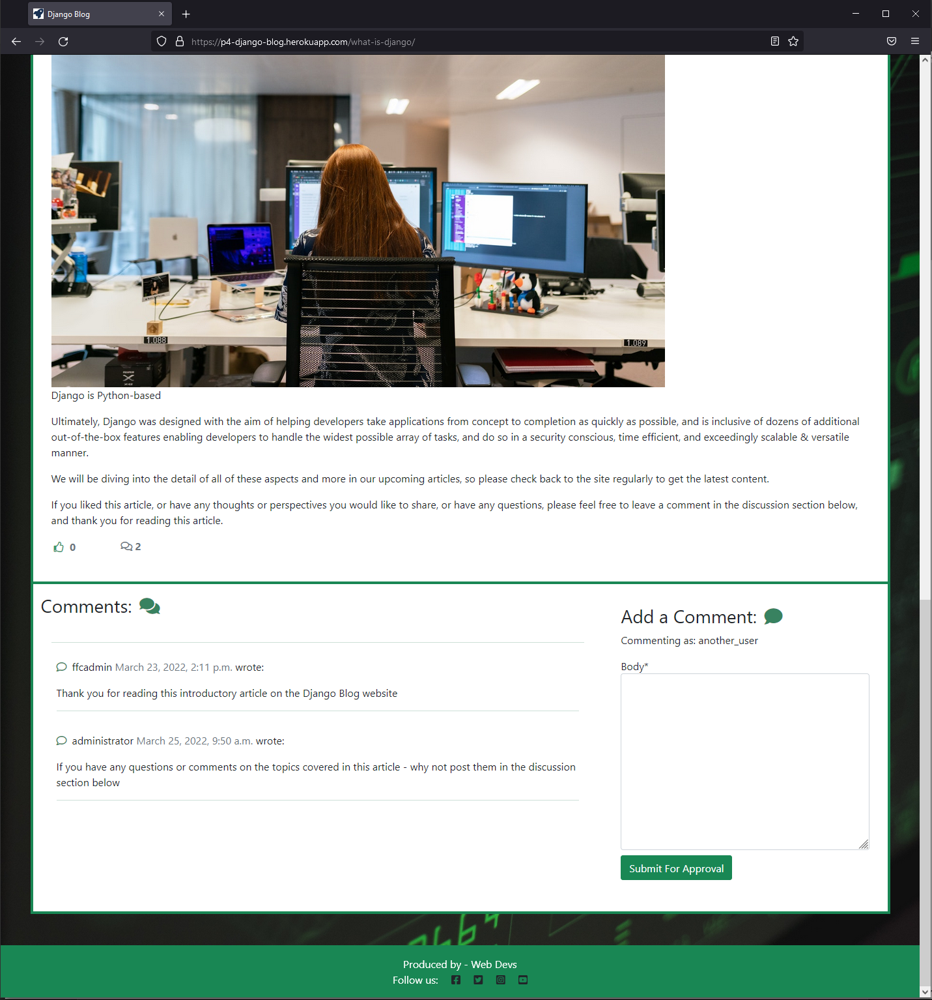
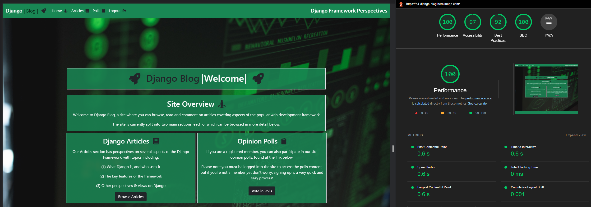
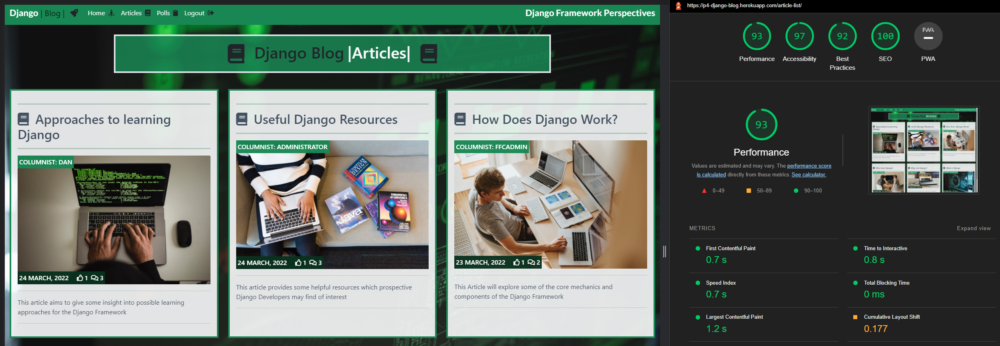
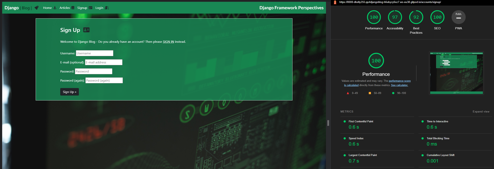
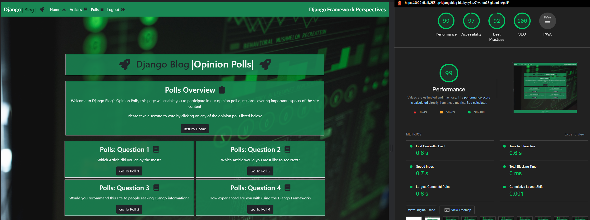

# Testing

## 1. Manual Testing - User Workflows:

The key tests below are part of the manual testing procedures I have followed to prove out the functionality of the primary User-based workflows available within the application:

No. |Test Case | Expected Result | Actual Result | Pass/Fail
 ------------- |------------- | ------------- | ------------ | ------------- 
  1 | Register an account | When clicking the `Sign Up` option, a user should be presented with the sign up form. Upon population of the required fields within the form, the user should  have a newly created account. | User account created as expected | Pass
  2 | Sign in | Upon clicking the `Login` option from the navigation bar, the `Sign In` form should display to the user, prompting a username & password. Upon entering these details, a user should be logged into the site| Log in option & form functions as expected | Pass
  3 | Open an article | When a user clicks on the `title` of an article, the detailed content of the article should load, together with the articles image, the excerpt, and the most recent time of editing - allowing a user to read the content of the article | Open article functionality operates as expected | Pass
  4 | Post a comment | Clicking into the `Leave a comment` section below an article should allow a user to compose & submit a comment in relation to the article content. Upon clicking of the `submit` button, a notification should be displayed to the user informing them that their comment has been submitted for approval | Post Comment functionality operates as expected | Pass
  5 | Like an article | Clicking the `like` icon under an article should increment the like count on the article by one. This functionality should only be available to users who are signed in - Users who are not signed in should be unable to add a like to an article. | Like functionality operates as expected for users - and will only permit likes from signed in users | Pass
  6 | Unlike an article | Clicking the `like` icon under an article for a *second time* should *decrement* the like count on the article by one. This functionality should only be available to users who are signed in - Users who are not signed in should be unable to remove (or add) a like to an article. | Functionality operates as expected| Pass
  7 | Sign out | When logged in and clicking on the `Logout` option from the navigation bar, a user should be presented with the `Sign Out` screen - asking the user for a confirmation that they do wish to sign out, and a `Sign Out` button which the user can click to formalise their Sign Out | Functionality operates as expected  | Pass
  8 | Navigation Bar & Signin Status | The Navigation bar should have two statuses - firstly, signed in, where the menu options should consist of `Home`, `Polls`, and `Logout`... and secondly, signed out, where the menu options should consist of `Home`, `Signup`, and `Login` | Functionality operates as expected | Pass
  9 | View Poll Question List | A user (when signed in) should be able to view a list of the available poll questions when clicking on the `View Polls` button from the landing page, or from the "Polls" option on the Nav bar | Functionality operates as expected | Pass
  10 | View Poll Question Answer Choices | A user should be able to view a list of the available answer choices for a poll question when clicking on the `Question` Link button from the polls index page | Functionality operates as expected | Pass
  11 | Vote in a Poll Question | A user should be able to vote for their preference from the available list of the answer choices for a poll question when selecting a `choice radio button` and clicking on the `Vote` button on the Poll Question Detail Page | Functionality operates as expected | Pass
  12 | View Poll Question Results Status | A user should be presented with a view of the current voting count per answer choice for a poll question after clicking on the `Vote` button from the polls Question Detail page | Functionality operates as expected | Pass

## 2. Manual Testing - Administrative Workflows:

The tests below are part of the manual testing procedures I have followed to prove out the functionality of the primary Administrator-based workflows available within the application:

No. |Test Case | Expected Result | Actual Result | Pass/Fail
 ------------- |------------- | ------------- | ------------ | ------------- 
  1 |Create an article | Upon clicking on the `Add Post +` button, an administrator should be able to populate the following form with all of the details required to create and publish a new article. The key fields should include - Title, Slug (which should autopopulate based on the title), Author, Image, Excerpt, the actual article content, and a status - draft or published | The Article creation feature works as expected | Pass
  2 |Delete an article | When an administrator selects a post, and clicks on the dropdown menu to choose the `Delete selected posts` option, a warning screen should present to the user highlighting that the article will be deleted. If the administrator proceeds to click on the `Yes I'm sure` button, the article and all associated comments & likes should be removed from the site | Delete article functionality operates as expected | Pass
  3 |Approve a comment | If an administrator selects an (unapproved) comment from the comments inventory, and chooses `Approve comments` from the dropdown menu, the comment should then appear for viewing under the article it was submitted against on the live website, with a date & timestamp | Approve comments functionality works per expectations | Pass
  4 |Delete a comment | If an administrator selects a comment (either approved or unapproved) from the comments inventory, and chooses `Delete Selected Comments` from the dropdown menu, a warning screen should display asking for a confirmation that this action is required. If the `Yes, I'm sure` button is clicked, then the comment should then be removed from the article it was submitted against | Delete comments functionality works as expected | Pass
  5 |Add an email address | If an administrator tries to add an email to a username who signed up without an email, they should be allowed to add the email, and should be able to mark the email as either, or both `verified` and `primary` | Functionality works as expected | Pass
  6 |Verify an email address | When an administrator follows the required steps to verify an email address by navigating within the administration pane to Accounts, followed by Email Addresses, and selects an email address - then selects `Mark selected email addresses as verified` from the dropdown menu, the email address should change from unverified status (with a red x icon) to verified (with a green tick icon) |Email address verification feature works as expected | Pass
  7 |Add a user | An administrator should be able to add a user manually to the database by navigating to the `Users` section of the Administration area, and clicking `add`. The following fields should be populated, building out the user's attributes (Username, Password, and password confirmation) and clicking `save`. A prompt should then be displayed to the administrator confirming that the user has been successfully added | Functionality performs as expected | Pass
  8 |Delete a user | When navigating to the `Users` section of the administration dashboard, a user with the correct access should be able to select a username from the available list, and select `Delete selected users` from the dropdown menu. Clicking `Go` should then trigger a warning message to the user, asking if they are sure they wish to proceed with the deletion, and clicking `Yes, I'm sure` should result in the deletion of the selected Username | Delete user functionality works as expected | Pass
  9 |Change a password | Note - this refers to the password change within the administrative area. By clicking on the `Change password` option from the top right menu in the Administration area, an administrator should be presented with the password change screen, where they can specify a new password after confirming their old password. Confirming the change should result in a confirmation screen that the change was successful | Password change functionality works as expected | Pass
  10 |Create a Question Poll | Upon clicking on the `Add Question +` button, an administrator should be able to populate the following form with all of the details required to create and publish a new article | The Question creation feature works as expected | Pass
  11 |Create Answer Choices for a Question Poll | Upon clicking on the `Add Choice +` button, an administrator should be able to populate the following form with all of the details required to create and add a new answer choice for poll questions | The answer creation feature works as expected | Pass
  12 |Edit a Poll Question  | Upon clicking on the `Question` link, and subsequently clicking into the Question required for editing, an administrator should be able to populate the following form with any of the details required to edit an existing Poll Question | The Question edit feature works as expected | Pass
  13 |Edit a Poll Answer Choice  | Upon clicking on the `Choice` link, and subsequently clicking into the Choice required for editing, an administrator should be able to populate the following form with any of the details required to edit an existing Poll Question Answer Choice | The Answer Choice edit feature works as expected | Pass
  14 |Delete a Poll Question | When an administrator selects a Question, and clicks on the dropdown menu to choose the `Delete selected Questions` option, a warning screen should present to the user highlighting that the Question will be deleted. If the administrator proceeds to click on the `Yes I'm sure` button, the Question and it's associated answer choices should be removed from the site | Delete Question functionality operates as expected | Pass
  15 |Delete a Poll Answer Choice | When an administrator selects a Choice, and clicks on the dropdown menu to choose the `Delete selected Choices` option, a warning screen should present to the user highlighting that the Answer Choice will be deleted. If the administrator proceeds to click on the `Yes I'm sure` button, the Answer Choice should be removed from the site | Delete Answer functionality operates as expected | Pass

## 3. Automated Testing:

### (i). Testing The Question Model's "was_published_recently" method 
The tests below are part of the Automated testing procedures I have used to prove out the functionality of some of the core aspects within the poll application. Please note - as called out in the readme credits section, and as noted in the poll/tests.py module code comments, I have heavily utilised the testing section of the [official Django Documentation](https://docs.djangoproject.com/en/4.0/intro/tutorial05/) in arriving at and building these tests, as they are effective at testing my poll app funcitonality for the purposes of the Blog Project:

Automated Test | Expected Result | Actual Result | Pass/Fail
 ------------- | ------------- | ------------ | ------------- 
  test_was_published_recently_with_future_question(self):| The method should return a "False" value if the question's publication date is in the future | The initial test run returned a value of true which caused my automated test to Fail | Fail (see screenshot below)

The solution to resolve this test error was to update the method in the Question model to ensure it returns "False" for dates in the future, and "True" for dates in the past. Upon making this change you can see the updated test results below:

Automated Test | Expected Result | Actual Result | Pass/Fail
 ------------- | ------------- | ------------ | ------------- 
  test_was_published_recently_with_future_question(self):| The method should return a "False" value if the question's publication date is in the future | As expected | Pass (see screenshot below)

Automated Test | Expected Result | Actual Result | Pass/Fail
 ------------- | ------------- | ------------ | ------------- 
  test_was_published_recently_with_old_question(self):| The method should return a "False" value if the question's publication date is older than one day | As expected | Pass 
  test_was_published_recently_with_recent_question(self):| The method should return a "True" value if the question's publication date is within the last one day | As expected | Pass

### (ii). Testing The Poll's View "IndexView"  

Automated Test | Expected Result | Actual Result | Pass/Fail
 ------------- | ------------- | ------------ | ------------- 
  test_no_questions(self):| If no questions exist in the poll, the error message "No Polls exist" should be displayed | The method functions as expected | Pass 
  test_past_question(self):| Questions with a published date in the past should be displayed on the polls index page | Method functions as expected | Pass
  test_future_question(self):| Questions with a publication date in the *future* should not be displayed on the polls index page | Method functions as expected | Pass
  test_future_question_and_past_question(self):| Only questions with a publication date in the past should be displayed on the poll index page, even if both past and future questions exist | Method functions as expected | Pass
  test_two_past_questions(self):| The polls question index page should be able to display multiple questions simultaneously | Method functions as expected | Pass

### (iii). Testing The Poll's View "DetailView"  

Automated Test | Expected Result | Actual Result | Pass/Fail
 ------------- | ------------- | ------------ | ------------- 
  test_future_question(self):| A 404 error should be returned for the DetailView of a question with a publication date in the future | The method functions as expected | Pass 
  test_past_question(self):| The question's text should be displayed for the detail view of a question with a published date in the past | Method functions as expected | Pass

## 4. Javascript Testing

As part of my testing activities I have also designed and implemented the Javascript test procedures below. The Javascript content of the site is primarly related to the notification messaging features, and I felt that manual test procedures would best fit the functionality involved:

No. |Test Case | Expected Result | Actual Result | Pass/Fail
 ------------- |------------- | ------------- | ------------ | ------------- 
  1 | User Login Message Notification | A user should be greeted with a `login success` notification message when they succesfully log in, the message should disappear again after the pre-set timeinterval in the Javascript function | The notification message appears and disappears as expected | Pass
  2 | User Logout Message Notification | A user should be greeted with a `logout` notification message when they succesfully log out, the message should disappear again after the pre-set timeinterval in the Javascript function | The notification message appears and disappears as expected | Pass
  3 | Account Creation Notification | A user should be greeted with a notification message when they succesfully create an account, the message should disappear again after the pre-set timeinterval in the Javascript function | Initially the notification message appears but would not disappear again as expected - See [Bug #8](https://github.com/dkelly255/pp4-django-blog/blob/main/BUGS.md#8-heroku-javascriptstatic-file-bug---messaging)| Fail
  4 | Account Creation Notification (re-test) | The notification message should disappear again after the Javascript -specified time interval - See [Bug #8 resolution](https://github.com/dkelly255/pp4-django-blog/blob/main/BUGS.md#8-heroku-javascriptstatic-file-bug---messaging) | Bug resolved and functionality now operates as expected | Pass

## 5. Browser Compatibility Testing

The site's compatibility with different browsers and device sizes has been extensively tested to help ensure the best positive experience for site users & visitors, with some of the primary browser & device-size compatability screenshots being displayed below:

- Google Chrome:

- Microsoft Edge:

- Mozilla Firefox:

- Android (Samsung Galaxy S10 Mobile):

- Apple Safari (iPad Tablet):

## 6. Accessibility Testing

The DevTools suite, and Lighthouse were used to audit the site's accessibility and found the only initial accessiblity deficiencies in the site were generally driven by Search Engine Optimisation and in some cases, Accessibility. The pre-SEO adjusted Lighthouse scores (with SEO deficiency) are shown below for reference

- Homepage Lighthouse Scores:

- Articles Page:

- Article Detail Display Page (pre-SEO adjustment):

- Login Page (pre-SEO adjustment):

- Signup Page (pre-SEO adjustment):

- Polls Page:

## 7. Compliance Testing

This section will review the testing activities undertaken to ensure compliant code throughout the project, including the HTML code passing through the official W3C validator, CSS code passing through the official Jigsaw validator, Javascript code passing through the `jshint es version:8` linter, and that the Python code is consistent in style and conforms to the PEP8 style guide:

### (i) HTML Validation

All HTML pages have been passed through the official W3C validator without any issues, (with the exception of the [article detail]() page - see context below) with accompanying screenshots of the output below:

- Home Page

- Articles Index

- Article Detail^

^Please note - errors number one and two below are driven by the summernote text interface and are known & understood. The `100%` attribute on the `width` of the `img` element is required to keep the image at 100% of the width of it's parent element for formatting purposes. The `No p element in scope` error number two should not be displaying, as I have taken the full contents of the html invovled & audited them in my text editor and can see that every `
` element has a corresponding `
` closure:

^Also please see [Bug #9](https://github.com/dkelly255/pp4-django-blog/issues/27) for a note on how adding images via the `content` field in the Django admin panel's content field when writing articles may also cause further issues driven by missing `alt text` attributes that cannot be directly injected to the HTML via jinja or templating without the use of a special API which is outside the scope of this project.

- Polls Index

- Poll Detail

- Poll Results

- Signup Page

- Login Page

- Logout page

### (ii) CSS Validation [(Jigsaw)](https://jigsaw.w3.org/css-validator/validator)

 

### (iii) Javascript Validation [(Jshint)](https://jshint.com/)

### (iv) Python Validation

This section will summarise the Python validation activities carried out across the various python files consisting the structure of the application, using the [PEP8 Online Check](http://pep8online.com/) utility:

#### **(a) Main Project Directory:** [PP4-DJANGO-BLOG/fantasyfootballcentre](fantasyfootballcentre):

No. |Python File | PEP8 Status | Screenshot 
------------- |------------- | ------------- | ------------ 
1 | [asgi.py](fantasyfootballcentre/asgi.py) | No issues | [link](readme/pep8/pep8-project-asgi.png)
2 | [settings.py](fantasyfootballcentre/settings.py) | Two Issues - E501 Line Length^ | [link](readme/pep8/pep8-project-settings.png)
3 | [urls.py](fantasyfootballcentre/urls.py) | No issues | [link](readme/pep8/pep8-project-urls.png)
4 | [wsgi.py](fantasyfootballcentre/wsgi.py) | No issues | [link](readme/pep8/pep8-project-wsgi.png)

#### **(b) Poll App Directory:** [PP4-DJANGO-BLOG/poll](poll):

No. |Python File | PEP8 Status | Screenshot 
------------- |------------- | ------------- | ------------ 
1 | [admin.py](poll/admin.py) | No issues | [link](readme/pep8/pep8-poll-admin.png)
2 | [apps.py](poll/apps.py) | No issues | [link](readme/pep8/pep8-poll-apps.png)
3 | [models.py](poll/models.py) | No issues | [link](readme/pep8/pep8-poll-models.png)
4 | [tests.py](poll/tests.py) | No issues | [link](readme/pep8/pep8-poll-tests.png)
5 | [urls.py](poll/urls.py) | No issues | [link](readme/pep8/pep8-poll-urls.png)
6 | [views.py](poll/views.py) | No issues | [link](readme/pep8/pep8-poll-views.png)

#### **(c) Website App Directory:** [PP4-DJANGO-BLOG/website](website):

No. |Python File | PEP8 Status | Screenshot 
------------- |------------- | ------------- | ------------ 
1 | [admin.py](website/admin.py) | No issues | [link](readme/pep8/pep8-website-admin.png)
2 | [apps.py](website/apps.py) | No issues | [link](readme/pep8/pep8-website-apps.png)
3 | [forms.py](website/forms.py) | No issues | [link](readme/pep8/pep8-website-forms.png)
4 | [models.py](website/models.py) | No issues | [link](readme/pep8/pep8-website-models.png)
5 | [tests.py](website/tests.py) | No issues | [link](readme/pep8/pep8-website-tests.png)
6 | [urls.py](website/urls.py) | No issues | [link](readme/pep8/pep8-website-urls.png)
7 | [views.py](website/views.py) | No issues | [link](readme/pep8/pep8-website-views.png)

^Note - Lines 167 and 132 in settings.py are generating an `E501 code` for line length (exceeding 79 characters by one character & three characters respectively) - this is known and understood, and per [this](https://peps.python.org/pep-0008/) section of the [PEP8](https://www.python.org/) guidelines I have made a jusdgement call that applying the guideline in these two specific instance `would potentially make the code less readable, even for someone who is used to reading code that follows this PEP.`
