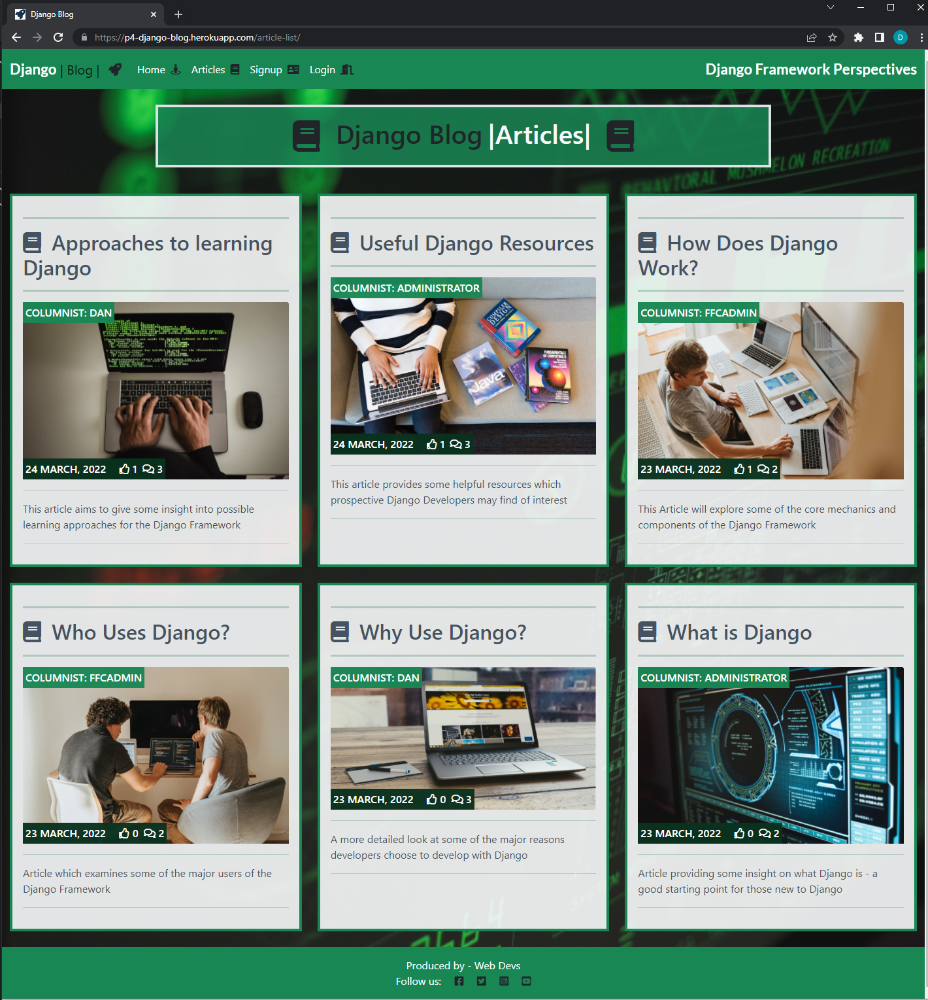
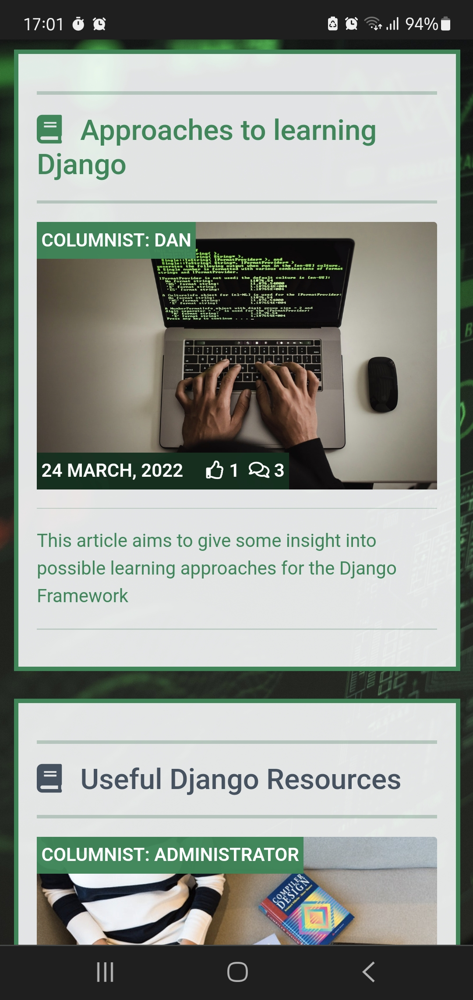

# Testing

## Manual Testing - User Workflows:

The key tests below are part of the manual testing procedures I have followed to prove out the functionality of the primary User-based workflows available within the application:

Test Case | Expected Result | Actual Result | Pass/Fail
 ------------- | ------------- | ------------ | ------------- 
  Register an account | When clicking the "Sign Up" option, a user should be presented with the sign up form. Upon population of the required fields within the form, the user should receive a confirmation email if they have specified an email address during sign-up, and should have a newly created account. | User account created as expected | Pass
  Sign in | Upon clicking the "Login" option from the navigation bar, the "Sign In" form should display to the user, prompting a username & password. Upon entering these details, a user should be logged into the site| Log in option & form functions as expected | Pass
  Open an article | When a user clicks on the title of an article, the detailed content of the article should load, together with the articles image, the excerpt, and the most recent time of editing - allowing a user to read the content of the article | Open article functionality operates as expected | Pass
  Post a comment | Clicking into the "Leave a comment" section below an article should allow a user to compose & submit a comment in relation to the article content. Upon clicking of the submit button, a notification should be displayed to the user informing them that their comment has been submitted for approval | Post Comment functionality operates as expected | Pass
  Like an article | Clicking the "like" icon under an article should increment the like count on the article by one. This functionality should only be available to users who are signed in - Users who are not signed in should be unable to add a like to an article. | Like functionality operates as expected for users - and will only permit likes from signed in users | Pass
  Unlike an article | Clicking the "like" icon under an article for a *second time* should *decrement* the like count on the article by one. This functionality should only be available to users who are signed in - Users who are not signed in should be unable to remove (or add) a like to an article. | Functionality operates as expected| Pass
  Sign out | When logged in and clicking on the "Logout" option from the navigation bar, a user should be presented with the "Sign Out" screen - asking the user for a confirmation that they do wish to sign out, and a "Sign Out" button which the user can click to formalise their Sign Our | Functionality operates as expected  | Pass
  Navigation Bar & Signin Status | The Navigation bar should have two statuses - firstly, signed in, where the menu options should consist of "Home" and "Logout"... and secondly, signed out, where the menu options should consist of "Home", "Signup", and "Login" | Fucntionality operates as expected | Pass

## Manual Testing - Administrative Workflows:

The tests below are part of the manual testing procedures I have followed to prove out the functionality of the primary Administrator-based workflows available within the application:

Test Case | Expected Result | Actual Result | Pass/Fail
 ------------- | ------------- | ------------ | ------------- 
  Create an article | Upon clicking on the "Add Post +" button, an administrator should be able to populate the following form with all of the details required to create and publish a new article. The key fields should include - Title, Slug (which should autopopulate based on the title), Author, Image, Excerpt, the actual article content, and a status - draft or published | The Article creation feature works as expected | Pass
  Delete an article | When an administrator selects a post, and clicks on the dropdown menu to choose the "Delete selected posts" option, a warning screen should present to the user highlighting that the article will be deleted. If the administrator proceeds to click on the "Yes I'm sure" button, the article and all associated comments & likes should be removed from the site | Delete article functionality operates as expected | Pass
  Approve a comment | If an administrator selects an (unapproved) comment from the comments inventory, and chooses "Approve comments" from the dropdown menu, the comment should then appear for viewing under the article it was submitted against on the live website, with a date & timestamp | Approve comments functionality works per expectations | Pass
  Delete a comment | If an administrator selects a comment (either approved or unapproved) from the comments inventory, and chooses "Delete Selected Comments" from the dropdown menu, a warning screen should display asking for a confirmation that this action is required. If the "Yes, I'm sure" button is clicked, then the comment should then be removed from the article it was submitted against | Delete comments functionality works as expected | Pass
  Add an email address | If an administrator tries to add an email to a username who signed up without an email, they should be allowed to add the email, and should be able to mark the email as either, or both "verified" and "primary" | Functionality works as expected | Pass
  Verify an email address | When an administrator follows the required steps to verify an email address by navigating within the administration pane to Accounts, followed by Email Addresses, and selects an email address - then selects "Mark selected email addresses as verified" from the dropdown menu, the email address should change from unverified status (with a red x icon) to verified (with a green tick icon) |Email address verification feature works as expected | Pass
  Add a user | An administrator should be able to add a user manually to the database by navigating to the "Users" section of the Administration area, and clicking "add". The following fields should be populated, building out the user's attributes (Username, Password, and password confirmation) and clicking "save". A prompt should then be displayed to the administrator confirming that the user has been successfully added | Functionality performs as expected | Pass
  Delete a user | When navigating to the "Users" section of the administration dashboard, a user with the correct access should be able to select a username from the available list, and select "Delete selected users" from the dropdown menu. Clicking "Go" should then trigger a warning message to the user, asking if they are sure they wish to proceed with the deletion, and clicking "Yes, I'm sure" should result in the deletion of the selected Username | Delete user functionality works as expected | Pass
  Change a password | Note - this refers to the password change within the administrative area. By clicking on the "Change password" option from the top right menu in the Administration area, an administrator should be presented with the password change screen, where they can specify a new password after confirming their old password. Confirming the change should result in a confirmation screen that the change was successful | Password change functionality works as expected | Pass

## Automated Testing:

### 1. Testing The Question Model's "was_published_recently" method 
The tests below are part of the Automated testing procedures I have used to prove out the functionality of some of the core aspects within the poll application. Please note - as called out in the readme credits section, and as noted in the poll/tests.py module code comments, I have heavily utilised the testing section of the [official Django Documentation](https://docs.djangoproject.com/en/4.0/intro/tutorial05/) in arriving at and building these tests, as they are effective at testing my poll app funcitonality for the purposes of the Blog Project:

Automated Test | Expected Result | Actual Result | Pass/Fail
 ------------- | ------------- | ------------ | ------------- 
  test_was_published_recently_with_future_question(self):| The method should return a "False" value if the question's publication date is in the future | The initial test run returned a value of true which caused my automated test to Fail | Fail (see screenshot below)

The solution to resolve this test error was to update the method in the Question model to ensure it returns "False" for dates in the future, and "True" for dates in the past. Upon making this change you can see the updated test results below:

Automated Test | Expected Result | Actual Result | Pass/Fail
 ------------- | ------------- | ------------ | ------------- 
  test_was_published_recently_with_future_question(self):| The method should return a "False" value if the question's publication date is in the future | As expected | Pass (see screenshot below)

Automated Test | Expected Result | Actual Result | Pass/Fail
 ------------- | ------------- | ------------ | ------------- 
  test_was_published_recently_with_old_question(self):| The method should return a "False" value if the question's publication date is older than one day | As expected | Pass 
  test_was_published_recently_with_recent_question(self):| The method should return a "True" value if the question's publication date is within the last one day | As expected | Pass

### 2. Testing The Poll's Class-Based View "IndexView"  

Automated Test | Expected Result | Actual Result | Pass/Fail
 ------------- | ------------- | ------------ | ------------- 
  test_no_questions(self):| If no questions exist in the poll, the error message "No Polls exist" should be displayed | The method functions as expected | Pass 
  test_past_question(self):| Questions with a published date in the past should be displayed on the polls index page | Method functions as expected | Pass
  test_future_question(self):| Questions with a publication date in the *future* should not be displayed on the polls index page | Method functions as expected | Pass
  test_future_question_and_past_question(self):| Only questions with a publication date in the past should be displayed on the poll index page, even if both past and future questions exist | Method functions as expected | Pass
  test_two_past_questions(self):| The polls question index page should be able to display multiple questions simultaneously | Method functions as expected | Pass

## Browser Compatibility

The site's compatibility with different browsers and device sizes has been extensively tested to help ensure the best positive experience for site users & visitors, with some of the primary browser & device-size compatability screenshots being displayed below:

- Google Chrome:

- Microsoft Edge:

- Mozilla Firefox:

- Android (Samsung Galaxy S10 Mobile):

- Apple Safari (iPad Tablet):

## Accessibility

The DevTools suite, and Lighthouse were used to audit the site's accessibility and found the only initial accessiblity deficiencies in the site were generally driven by Search Engine Optimisation and in some cases, Accessibility. The pre-SEO adjusted Lighthouse scores (with SEO deficiency) are shown below for reference

- Homepage Lighthouse Scores (pre-SEO adjustment):

- Articles Page (pre-SEO adjustment):

- Article Detail Display Page (pre-SEO adjustment):

- Login Page (pre-SEO adjustment):

- Signup Page (pre-SEO adjustment):

