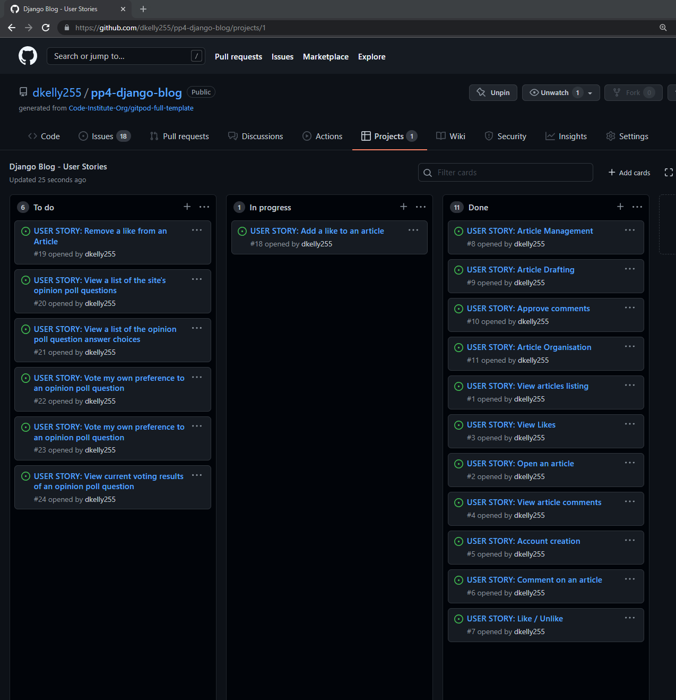
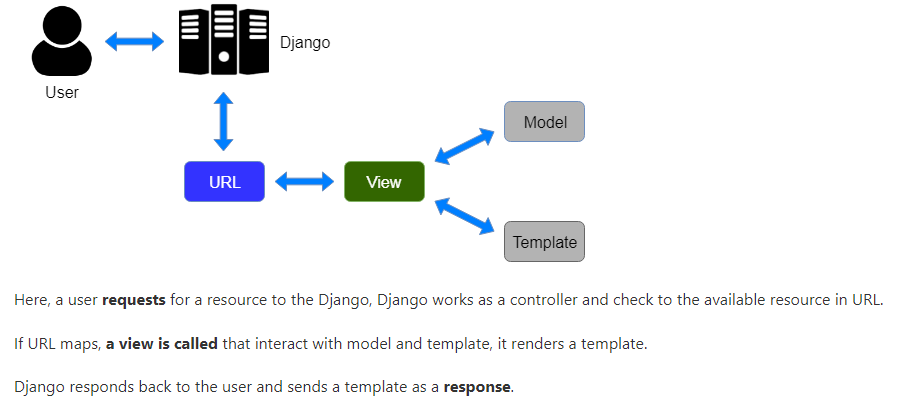
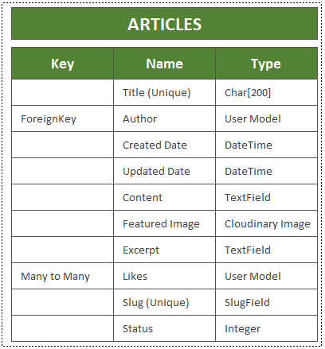
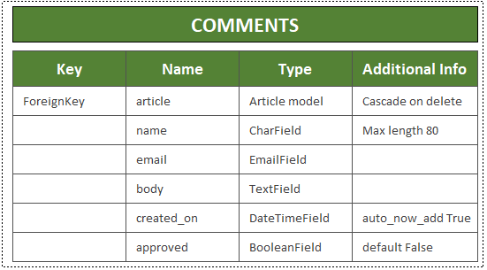
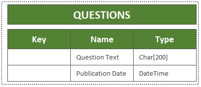
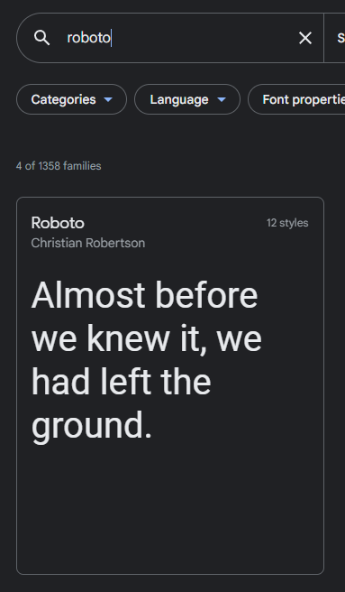
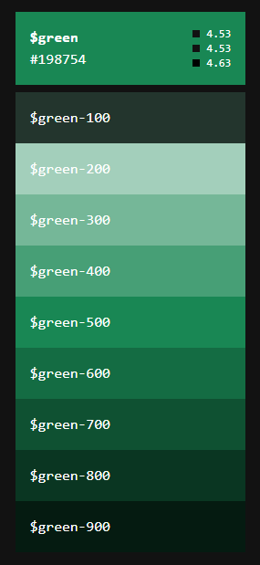

# UX Planes
I have designed the site using the five planes of UX approach, each of which is reviewed in detail in the following sections
## 1. Strategy
The strategy for the site is to offer a resource to users interested in the Django framework where they can obtain content in the form of Articles, and can have the ability to post their own comments on the subject matter to engage in discussion within a braoder community of Django users. 

The strategic aim of the site is to address the following **User Stories**:

### **As a site user I can:**
- Create and register for an account so that I can add my own comments and likes to the articles and content
- View a list of the site's articles so that I can select one to read
- View an organised list of articles so that I can select which article I wish to view
- Open an article so that I can read the full content
- Add my own comments to articles so that I can join in the discussion on current Django hot topics and issues
- Add a like to an article so that I can provide my opinion on the content
- Remove a like from an article so that I can correct the record if I have mistakenly added a like
- View a list of the site's opinion poll questions so that I can view the issues being polled
- View a list of the opinion poll question answer choices so that I can assess which answer best fits my perspective
- Vote my own preference to an opinion poll question so that I can have my opinion counted in the poll

### **As a site administrator I can:**
- Have full CRUD (Create, Read, Update, Delete) abilities so that I can manage the content of the website - both polls and articles
- Create draft articles so that I can complete the articles at a later time
- Approve or reject comments so that I can ensure no unacceptable comments are posted on the site

### **As both a site user and administrator I can:**

- View a count of likes on each article so that I can guage general user sentiment on the site content
- View other user's comments on articles so that I can understand other site user's perspective's an opinions on the content
- View the current voting results status of an opinion poll question so that I can assess user sentiment on polled issues

## 2. Scope

To deliver the scope of the project, an Agile approach to Software Development has been pursued for the project implementation. There are many useful resources available giving context and perspectives on the advantages of an Agile Software Development practice - including the [Agilemanifesto.org](https://agilemanifesto.org/) and [Agilealliance.org](https://www.agilealliance.org/agile101/) which are good starting points, and summarise Agile Software Development as "Individuals and interactions over processes and tools, Working software over comprehensive documentation, Customer collaboration over contract negotiation, and Responding to change over following a plan" 

There are many principles and features common to Agile approaches, including, Scrums, Sprints, and Kanban boards - I am currently managing the project scope via multiple kanban boards using Github's built-in Kanban board functionality, with a board for managing the delivery of user stories, and a board for managing the bugs & debugging exercises through the development lifecycle. And work through daily sprints in taking each of the tasks through their stages of completion:

A view of the Kanban board with the user stories having been brought through "To Do", "In Progress", and "Done" columns as follows:

### (i) Kanban Board #1 - User Stories

With the equivalent Kanban board for the debugging exercises having been brought through similar phases of completion including - "Not Assigned", "In Progress", and "Closed" columns as follows:

### (ii) Kanban Board #2 - Bugs & Debugging

If you wish to review the boards in more detail, please navigate to the [Projects](https://github.com/dkelly255/pp4-django-blog/projects) section of the Github repository, where you will find direct links allowing a deeper dive into the detail of [Kanban Board #1 (User Stories)](https://github.com/dkelly255/pp4-django-blog/projects/1) and [Kanban Board #2 (Bugs & Debugging)](https://github.com/dkelly255/pp4-django-blog/projects/2)

## 3. Structure

The website is structured using the Django Framework functionality, with a home page, an articles page, a login option, and a signup page. The home page greets the visitor with a welcome message and links to the the main content of the site, the articles page houses the Django Articles, together with the comments that have been posted by other users/viewers.

The core website data  will be stored in Heroku's PostgreSQL add-on, and website static files and media/images will be stored on the Cloudinary Platform. I have made the decision to store website images on Cloudinary rather than Heroku due to the fact that Heroku is an ephemeral file system, and the Dyno system it utilizes can cause problems in situations where the project has been idle or if it has not been accessed for a certain length of time. Cloudinary is a persistent file store, and will therefore minimise the likelihood of such issues occurring and interrupting or deteriorating the User Experience, ensuring site visitors have less chance of seeing broken image links when browsing the site. In terms of the Cloudinary design choice, it is also less complicated to setup than other persistent file stores (such as Amazon S3 or Microsoft Azure) so will fit well for the scope of this project.

## Code Structure

### - *Model, View, Template*

Generically the project is structured using the "Model, View, Template" software design pattern. 

- The Model supports with database management, being a data access layer which primarily handles data. 
- The Views are used toe xecute the business logic and interact with the model to carry data and render a template
- The Templates are the presentation layers, which handle the User Interface aspects of the application.

The diagram below (sourced from [javatpoint.com](https://www.javatpoint.com/django-mvt)) illustrates the MVT structure & control flow used for this project:

### - *Requirements.txt* 

The project structure includes a requirements.txt in keeping with Python Standards & best practices - as per this overview from [idkrtm.com](https://www.idkrtm.com/what-is-the-python-requirements-txt/), the requirements.txt file is used for specifiying which Python packages are required to run the overall project.

The current packages and dependencies list for the project are shown below:

### - *Procfile*

A Procfile is also an integral element of the project structure - as per the overview in [medium.com](https://medium.com/@bennettgarner/deploying-django-to-heroku-procfile-static-root-other-pitfalls-e7ab8b2ba33b) - the Procfile is a file in the project's root directory that tells Heroku how the application should start and run - in this case, via a Gunicorn server.

## Database Structure & Schema

### 1. Website App

The website app's content will utilise a simple database structure, consisting of two main models - one for the Articles about Django topics, and one for the comments that users can add to those articles

The Entity Relationship Diagram for the Articles Table is shown below, with the field names, types, and key status. 

Note the Foreign Key will be the "Author" field, and that the "Likes" field will also need to have a many to many relationship:

The Entity Relationship Diagram for the Comments Table is shown below, with the field names, types, key status, and additional information. 

Note the Foreign Key will be the "Post" field, and that this will need to cascade on delete, so that when a post is removed, the comments on that post are also removed, that is, the deletion is cascaded through the models.

### 2. Poll App

The poll app's content will also be implemented via a relatively simple database structure, consisting of two main models - one for the Poll Questions, and one for the choices that users can vote for under each of these questions

The Entity Relationship Diagram for the `Questions` Table is shown below, with the field names, types, and key status:

The Entity Relationship Diagram for the `Choices` Table is shown below, with the field names, types, key status, and additional information. 

Note the Foreign Key will be the "Question" field, and that this will need to cascade on delete, so that when a Question is removed, the choices for that question are also removed, that is, the deletion is cascaded through the models.

### - Production Database - PostgreSQL:

The database system used for the models in production is an application known as [PostgreSQL](https://www.postgresql.org/). 

As illustrated in this overview at [postgresqltutorial.com](https://www.postgresqltutorial.com/what-is-postgresql/) - PostgreSQL is an advanced, enterprise-class, open-source relational database system, which supports both relational querying, and is compatible with most popular programming languages (including Python) and is therefore ideal for the requirements of this project.

### - Development Database - SQLite3:

The database system used for the models in testing and development is an application known as [SQLite3](https://www.sqlite.org/index.html). 

As illustrated in this overview at [Python.org](https://docs.python.org/3/library/sqlite3.html) - SQLite3 a C library that provides a lightweight disk-based database that doesn’t require a separate server process and allows accessing the database using a nonstandard variant of the SQL query language, and is typically used in Django Applications for testing & development.

Note - for more information, please see the `Testing` and `Bugs` readme sections for more detail on the two databases - SQLite3 and PostgrSQL and changing between the two.

### - Crispy Forms

The project structure also utilises an application known as [CrispyForms](https://django-crispy-forms.readthedocs.io/en/latest/) to enable controlling the rendering behaviour of the key forms within the application.

As per this overview article at [merixstudio.com](https://www.merixstudio.com/blog/django-crispy-forms-what-are-they-about/) Django-crispy-forms is an application that helps to manage Django forms and allows adjusting forms' properties (such as method, send button or CSS classes) on the backend without having to re-write them in the template.

### - Summernote

Summernote is used as an editor for the article functionality within the site. The Summernote [website](https://summernote.org/) contains comprehensive & useful documentatino on the editor - for the purposes of this project's structure - it is used as a "WYSIWYG" (What You See Is What You Get) editor, due to it's simple & easy-to-use nature.

## 4. Skeleton

The wireframes below illustrate the skeleton of the site, including the home page, login page, signup page, together with the various nav bars and footers that underpin the site structure:

- Wireframe 1 - Home Page

- Wireframe 2 - Article detail & comments 

- Wireframe 3 - Signup Page

- Wireframe 4 - Login page

- Wireframe 5 - Administration page

## 5. Surface

I have used the Bootstrap framework to build the Surface of the website, with the following design choices helping to deliver the optimum user experience:

- Typography

For the Fonts on the site I am primarily using [Roboto](https://fonts.google.com/specimen/Roboto?query=roboto) for site content - As per the overview on Google Fonts [linked](https://fonts.google.com/specimen/Roboto?query=roboto), Roboto has a dual nature, with a mechanical skeleton and the forms are largely geometric. At the same time, the font features friendly and open curves. While some grotesks distort their letterforms to force a rigid rhythm, Roboto doesn’t compromise, allowing letters to be settled into their natural width. This makes for a more natural reading rhythm more commonly found in humanist and serif types.

The [Lato](https://fonts.google.com/specimen/Lato?query=lato) font is also used - and is a sans serif typeface family started in the summer of 2010 by Warsaw-based designer Łukasz Dziedzic (“Lato” means “Summer” in Polish):

- Imagery

I am using Django related imagery throughout the Surface layer of the site, to help with promoting a positive User Experience for the target audience. The imagery is primarily consisted of different Django-related pictures & diagrams. Some examples are shown below:

- Color Palette

As part of the surface layer of the website's user experience, I wanted to use a green color palette as part of the site's theme - Bootstrap has a large array of color-schemes & themes to choose from, illustrated in the screenshot below:

A deeper dive on the Green color scheme allows many different shades, hues, and opacities depending on the user's needs, for themajority of the site's surface I am using the default shade of green (code #198754 & its' derivations) - shown below:

